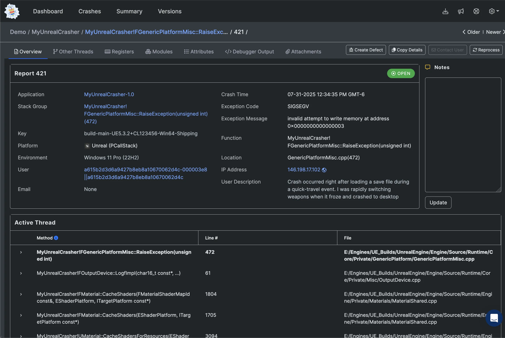

# What is BugSplat?

BugSplat is the developer's go-to toolbox for finding, understanding, and fixing crashes. With BugSplat, developers know exactly which issues are causing their [end-users](../education/bugsplat-terminology.md#end-users) to experience crashes while using their product.

When a crash event occurs, BugSplat captures data critical for understanding the underlying defect. This data is presented in a familiar “debugger” view which allows developers to triage crashes as if the crash was captured locally on their own machine.

<figure><figcaption></figcaption></figure>

With BugSplat, developers can identify more issues during testing, monitor the quality of their shipped applications, and improve their workflow around development and support.

Overall, applications that use BugSplat are more stable, crash less often, and become cheaper and easier to support.

BugSplat is built on AWS’s scalable infrastructure which provides a secure and reliable service to developers and their end-users.

BugSplat supports all kinds of [platforms and languages ](../introduction/getting-started/integrations/)as well as [third-party tools integrations](../introduction/development/integrating-with-tools/).

If you're not sure if BugSplat is right for your application or game, please send us a note so we can understand your needs better!

* [Email us](mailto:hi@bugsplat.com)
* [Join our Discord](https://discord.gg/K4KjjRV5ve)

To get started with BugSplat, sign up for a free BugSplat account at [https://app.bugsplat.com/v2/sign-up](https://app.bugsplat.com/v2/sign-up).
