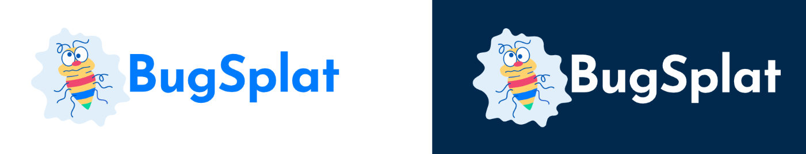
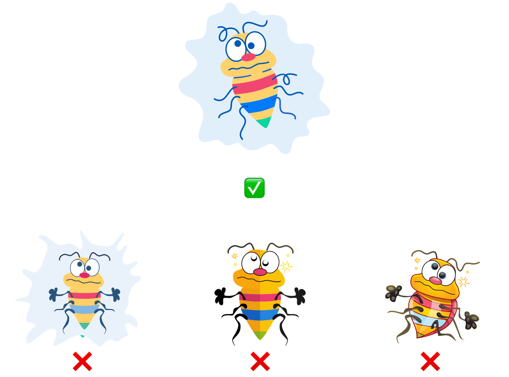
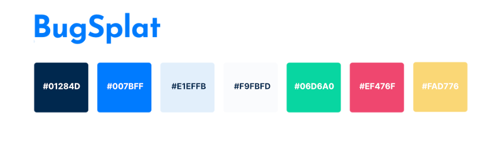
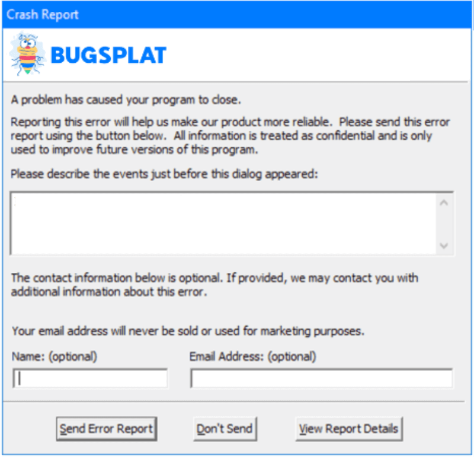
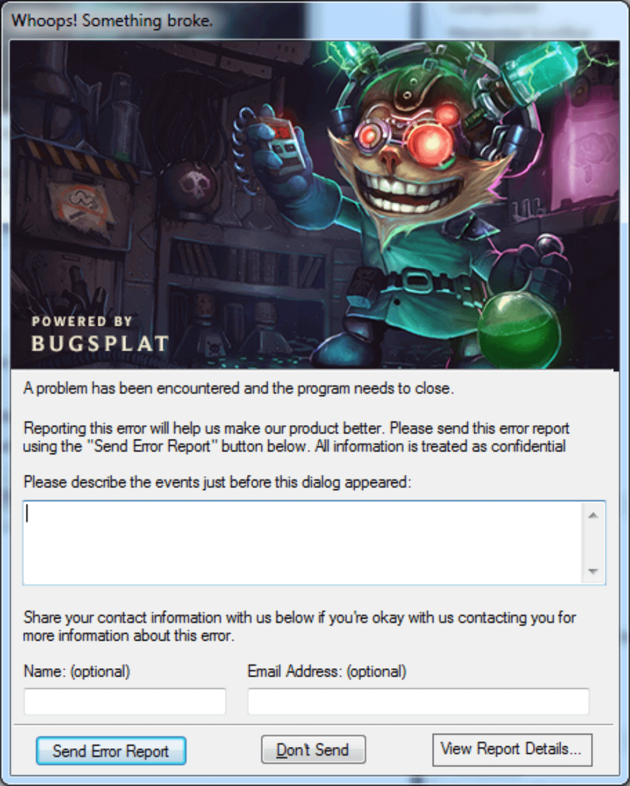
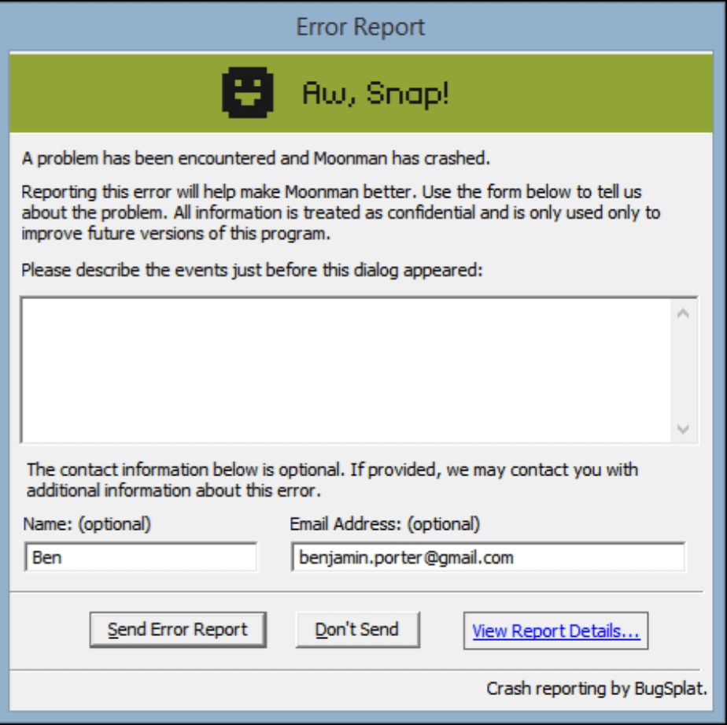
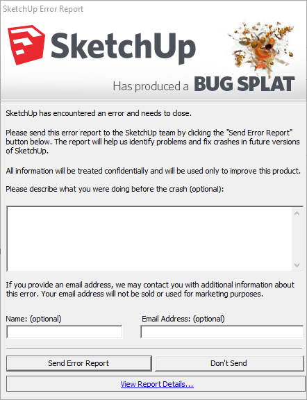

# Brand Guidelines

## **Basic Info**

Is your team getting ready to ship your software with BugSplat crash reporting baked in? Want to announce it to customers or other stakeholders?

That's great! We just have a few small guidelines that we ask you to follow.

These guidelines were inspired by Bootstrap's [Brand Assets](https://getbootstrap.com/about/#team) which follow a similar post by [MailChimp](https://styleguide.mailchimp.com/).

## **Logo**

Below are the acceptable iterations of our logo for light and dark backgrounds.

### \*\*\*\*

### **The Bug**

We love our Bug. It's been seen millions of times by computer users around the planet in connection with our brand. However, it is certain that not everyone will be familiar with it and that's why we ask for consistency.

Many people will see our brand for the first time because of your interaction with BugSplat. If you are using our brand in a setting where the audience may not be familiar with BugSplat, please use full logo shown in the section above.

\*\*\*\*

## **In Writing**

Our company and crash reporting tool should always be referred to as **BugSplat**. Specifically, note the CamelCase \( Bug Splat\) and that it is always written as one word.

| Spelling | Correct? |
| :--- | :--- |
| BugSplat | ✅ |
| Bug Splat | ❌ |
| bugsplat | ❌ |
| Bugsplat | ❌ |

## **Colors**

BugSplat's never been afraid of a little color - or a lot of color - in our brand. We use these colors in our logo, in our docs, and around our site. You can grab the Hex Color Codes in downloadable brand assets available at the top of this page.

## **Crash Dialog**

Our crash box is the consumer-facing portion of our crash reporting tool. As such, it follows the same guidelines as the rest of our brand.

Some monthly plans require that you use our standard crash box \(see below\).

Most implementations of BugSplat do not require you to use our branded crash dialog shown above. That said, we love and appreciate when our users keep our crash dialog or give us a 'shoutout' somewhere on the box.

This helps us spread the word about BugSplat, allowing us to spend less time on marketing and more time into making great products for our customers.

If you want to give us a shout-out, please put our name in either the header or the bottom right-hand corner of the crash box.

Be sure to send us an image of your customized crash box. If it's really cool, we'll include it and a link to your site or project below. :\)

### **Wall of Fame**

