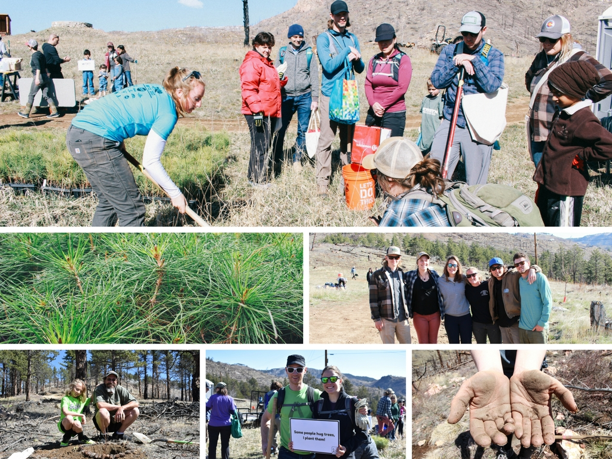

# Charitable Giving

## Pledging at least 1%

BugSplat has taken a pledge to give at least 1% of our annual profits to charitable causes close to our hearts through the [Pledge 1%](https://pledge1percent.org/) program. &#x20;

As we continue to grow and build our business we're constantly looking for more ways to give back.  Our goal is to expand past giving 1% of profits in the coming year (2021/2022) to also giving 1% of our employee's time to causes we care about. &#x20;

## Our Causes

### Stripe Climate&#x20;

BugSplat is part of Stripe Climate, a coalition of businesses accelerating carbon removal.

No company can stop climate change by itself. [Stripe Climate](https://stripe.com/climate) aggregates funds from forward-thinking businesses around the world to increase demand for carbon removal. Stripe Climate works with [Frontier](https://frontierclimate.com/), Stripes' in-house team of science and commercial experts, to purchase permanent carbon removal.

Learn more here 👉 [https://climate.stripe.com/mbVoun](https://climate.stripe.com/mbVoun)

### One Tree Planted&#x20;

BugSplat is very proud to provide support to [One Tree Planted](https://onetreeplanted.org/) in its mission to help replant trees and combat deforestation.

One Tree Planted is a 501(c)(3) nonprofit dedicated to global reforestation. Their mission is to reforest the planet, one tree at a time. Every $1 donated helps plant 1 tree. It's that simple. They also raise awareness about the importance of trees, offer businesses like ours a simple sustainability solution, and motivate younger generations to do something positive for the environment.

One Tree Planted does fantastic work around the world - but they also have had a direct impact right in our home state of Colorado.

Planting trees helps to protect our water supply, reduces the impact of forest fires, preserves our beautiful wild spaces, and more. You can learn about [Colorado forest management](https://www.globalforestwatch.org/map/country/USA/6?mainMap=eyJzaG93QW5hbHlzaXMiOnRydWV9\&map=eyJ6b29tIjo2LjUwMzM3MzkyNTY4MDY2NSwiY2VudGVyIjp7ImxhdCI6MzkuMDI1NDcxMjcwNDQ3NTU0LCJsbmciOi0xMDUuNTUxNTUwMDAwMDAwMDJ9LCJjYW5Cb3VuZCI6ZmFsc2UsImJib3giOltdLCJiZWFyaW5nIjowLCJwaXRjaCI6MH0%3D\&menu=eyJtZW51U2VjdGlvbiI6IiIsImRhdGFzZXRDYXRlZ29yeSI6IiIsInNlYXJjaCI6IkNvbG9yYWRvIn0%3D) and read about all that [One Tree Planted has done in Colorado](https://onetreeplanted.org/blogs/stories/reforestation-recap-trees-colorado) on their website.

This partnership is a real 'no-brainer' for our team - we're working hard so we can cut out early to enjoy the fantastic outdoors Colorado has to offer. All of our favorite activities, like skiing, hiking, mountain biking, and climbing, benefit from beautiful and well-managed mountain forests.  Furthermore, reforestation is critical to repairing global ecosystems and combatting the climate crisis.

So for every new BugSplat customer that signs up, we plant trees! The more crash reports you buy, the more trees we donate to One Tree Planted!

