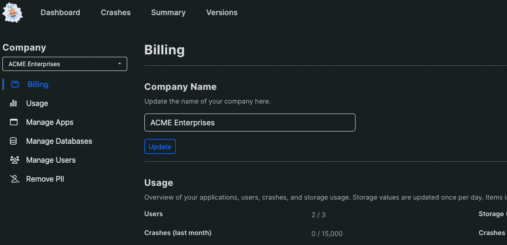

# Changing Company Name

Changing your company name in BugSplat is easy!

When you create a new BugSplat account, your company is named by default after your first database, which is typically derived from your email address. However, for many reasons, you may want to change the company name to something that better reflects your team or organization.

Follow these simple steps to update your company name:

#### Steps to Change Your Company Name

1. **Navigate to the Billing Page**\
   Head to your [Billing page](https://app.bugsplat.com/v2/company/billing).
2. **Enter Your New Company Name**\
   At the top of the page, you’ll find a field where you can enter your new company name.
3. **Hit 'Update'**\
   Once you’ve entered the new name, click the **'Update'** button.
4. **Confirmation Modal**\
   A confirmation modal will appear to verify the change.

And that’s it! Your company name will now be updated.

<figure><figcaption></figcaption></figure>

#### Important Notes

* Only **non-restricted users** have the ability to change the company name.
* If you don’t have the necessary permissions, reach out to an administrator on your account.

If you run into any issues or have questions, feel free to contact our support team for assistance.
