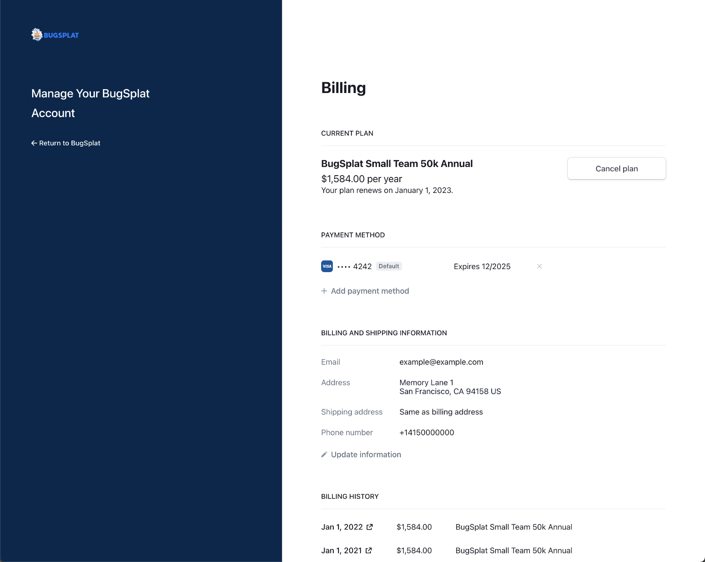

# Managing Payment Details

Current account holders interested in updating their plan to a different level (Team or Business), adjusting the number of monthly reports, or adding/subtracting users and databases, should navigate to the [Billing](https://app.bugsplat.com/v2/settings/company/billing) page in Settings and click on the button that says Update Plan Details.

Note that if you do not see an option to navigate to the Billing page it's likely because you are a Restricted Users.  Please contact a [Non-Restricted](../introduction/user-permissions.md) user on your team to gain access to [Billing](../billing/).

{Insert Image}&#x20;

This will bring up the Set Plan Details pop-up where account holders can update key settings for their account. &#x20;

Once the desired change has been made click '{Button Name}' to confirm the changes. &#x20;

## Adding or Updating Payment Specific Information

Current account holders interested in updating information associated with their account can do so by navigating to the [Billing](https://app.bugsplat.com/v2/settings/company/billing) page in Settings and clicking on the link that says 'Manage your plan.'

This will bring you to the plan management portal where users can manage their account details. &#x20;

Here account holders can update their credit card, billing address, email that receives billing information.  This page is also where account holders can add VAT information.

{Stopped here on Monday}

### View and Download Billing History

Account holders interested in updating information associated with their account can do so by navigating to the [Billing](https://app.bugsplat.com/v2/settings/company/billing) page in Settings and clicking on the link that says 'Manage your plan.'&#x20;

Once on this page scroll to the bottom to view or download previous receipts and invoices associated with their account.&#x20;
