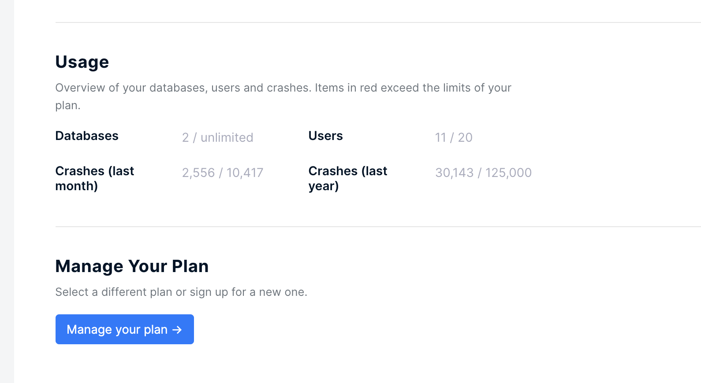

# Adding Billing Address for VAT Purposes

Adding or updating your business address is possible through the BugSplat payment portal. This is particularly useful for adding a business address to invoices for VAT purposes.

To do so, navigate to the [Billing](https://app.bugsplat.com/v2/settings/company/billing) page in Settings and click on the link that says 'Manage your plan.'

Next, click the link that says 'Update Information' under the title Billing information. There you can enter your billing address. Your billing information will include it on your next invoice.

This only works for users who are paying for BugSplat monthly via a credit card.

If you have any questions or want further confirmation, please email [sales](mailto:sales@bugsplat.com).
