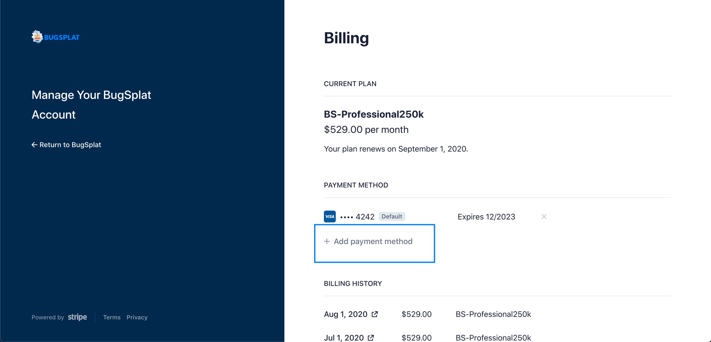

# Updating Credit Card Associated with Account

Upgrading the credit card associated with your BugSplat account is easy. To do so, navigate to the [Billing](https://app.bugsplat.com/v2/settings/company/billing) page in Settings and click on the link that says 'Manage your plan.'

Next, click the button that says '+ Add payment method' and enter a new credit card. Make sure the box below the space to enter your card details is checked, designating the new card as the default card on the account.

Once updated will see the change reflected on the page shown in the image above.

This only works for users who are paying for BugSplat monthly via a credit card.

If you have any questions or want further confirmation, please email [sales](mailto:sales@bugsplat.com).
