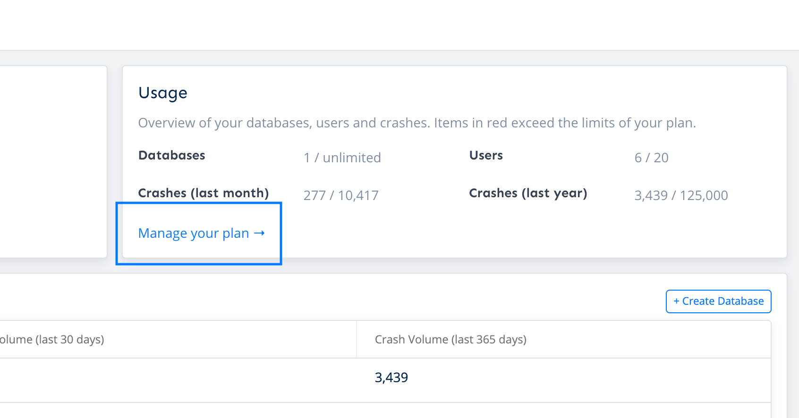

# Updating Email Address for Receipts and Invocies

Adding or updating your business email is possible through the BugSplat payment portal. Changing this email address will alert who receives invoices and receipts for monthly billed plans.

To do so, navigate to the [Company](https://app.bugsplat.com/v2/company) page and click on the link that says 'Manage your plan.'

Next, click the link that says 'Update Information' under the title Billing information. There you can enter your email address. Your next invoice will be sent to this email address.

