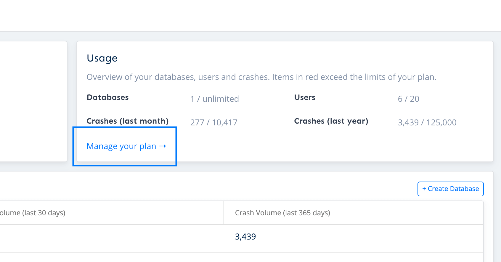

# Viewing Billing History and Past Invoices

For customers who pay via credit card, it’s easy to access and download documents associated with billing history.

To do so, navigate to the [Company](https://app.bugsplat.com/v2/company) page and click on the link that says 'Manage your plan.'

On the next page, you can view or download previous invoices. Simply scroll down the page and click on any month under the heading ‘Billing History’.

This only works for users who are paying for BugSplat monthly via a credit card.

Can’t find exactly what you’re looking for? Send us a note at email [sales@bugsplat.com](mailto:sales@bugsplat.com) and we’ll be more than happy to help.

