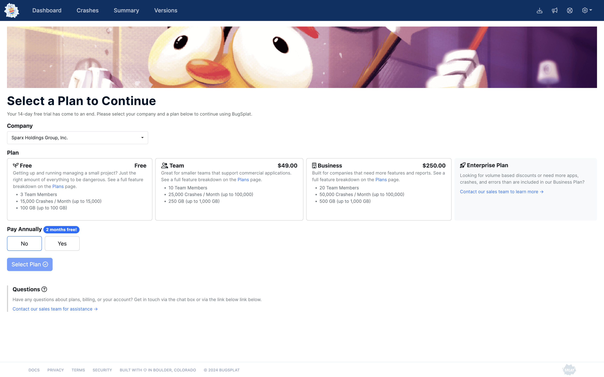
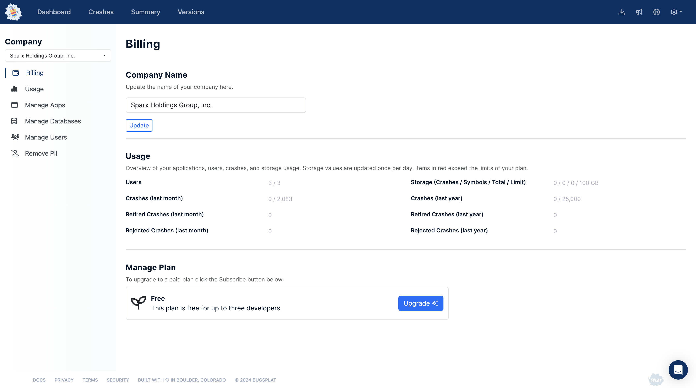
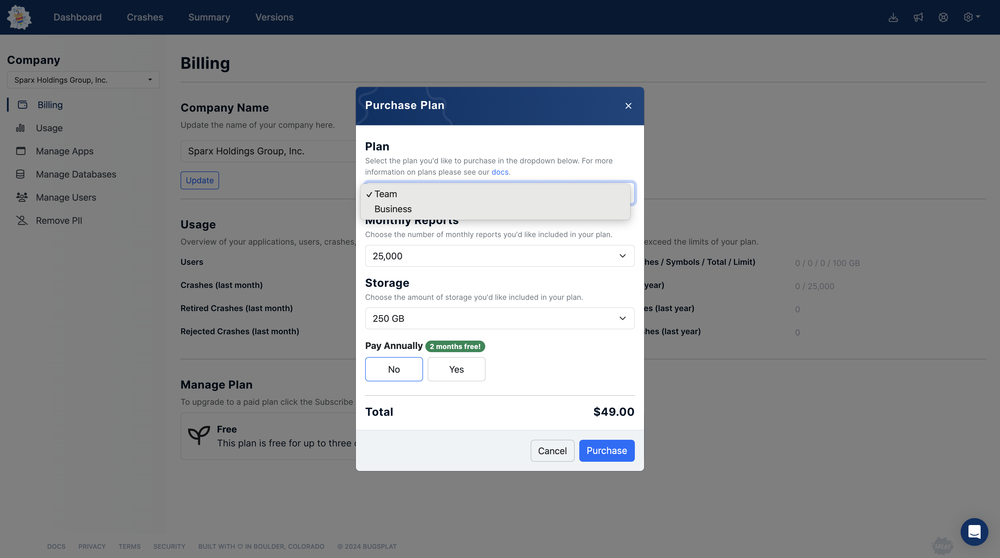
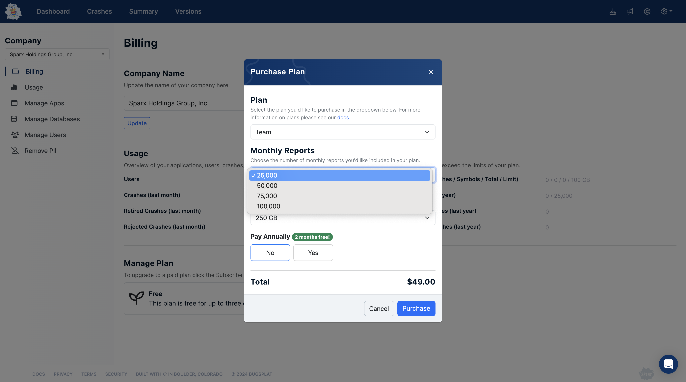
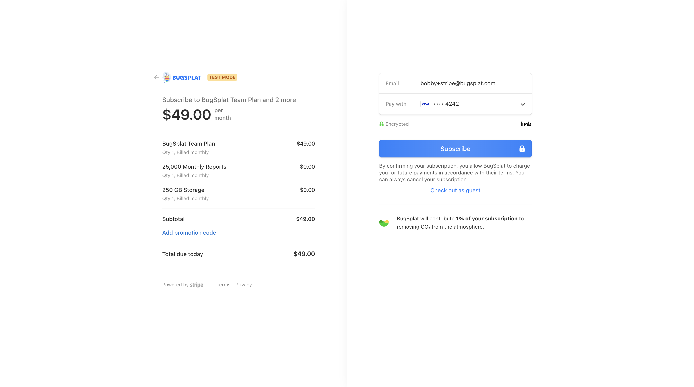
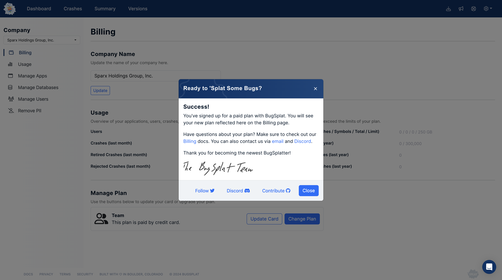

# How to Sign Up for a BugSplat Plan

**Welcome to BugSplat!** Here's your straightforward guide to getting started with our crash reporting service. Let's dive into how you can sign up, evaluate, and choose the plan that's just right for your development needs.

**Getting Started: The 14-Day Free Trial**

Your journey with BugSplat begins with our [14-day Free Trial](free-trial.md). We believe the best way to understand the value of BugSplat is by giving it a spin, risk-free. Here's how to kick things off:

1. **Sign Up for the Free Trial:** Head over to our sign-up page and create your BugSplat account. No credit card required; just your enthusiasm for making your software the best it can be.

#### **Deciding Your Next Steps Post-Trial**

When your trial ends you'll be shown a screen asking for options about the future of your account.  You'll be able to choose:

<figure><figcaption></figcaption></figure>

* **Continue with the Free Plan:** If you're still exploring or if your project is small-scale, our Free Plan might be just what you need.
* **Upgrade to a Paid Plan:** Ready for more? You can jump straight into selecting a Team or Business plan tailored to your project's scale.
* **Request More Time:** Sometimes, you need a bit more time to decide. We get it. Let us know, and we can extend your trial.

**Upgrading Anytime: A Step-by-Step Guide**

Whether you're still in your trial or using the Free Plan, upgrading is a breeze:

1. **Visit the Billing Page:** Navigate to [your account's Billing page](https://app.bugsplat.com/v2/company/billing). Remember, this step requires non-restricted user access.
2.  **Hit 'Upgrade ✨':** Inside the Billing Page, you'll find the Upgrade button. A click here is your first step towards unlocking BugSplat's full potential.

    <figure><figcaption></figcaption></figure>
3.  **Choose Your Plan:** A payment model will pop up, allowing you to select between the Team or Business plans. Not sure which to choose? Our [Plans page](https://www.bugsplat.com/plans/) details the differences.

    <figure><figcaption></figcaption></figure>
4.  **Customize Your Plan:** Select how many monthly crashes and errors you need and the amount of storage that suits your team. Then, decide if you want to pay monthly or annually—the latter saves you the equivalent of two months!

    <figure><figcaption></figcaption></figure>
5.  **Enter Payment Details:** Next, you'll be directed to the Stripe Billing portal to enter your payment information.

    **Promotions and Coupons:** Got a promo code or coupon from us? This is the moment to apply it and score some savings.

    <figure><figcaption></figcaption></figure>
6.  **Subscription Confirmation:** After hitting 'Subscribe,' you'll be taken back to the Billing page, where your plan adjustments will be reflected in the Usage and Manage Plan sections. Curious about the impact of your new plan? The Usage page will show you exactly that, including your new plan type.

    <figure><figcaption></figcaption></figure>

**Need to Make More Adjustments?**

Whether it's adding more crashes, increasing storage, upgrading further, or even cancelling, we've got you covered with our comprehensive docs (linked separately for your convenience).

**Need a Hand?** Our team at sales@bugsplat.com is ready to assist with any queries or to provide additional support as you set up your ideal crash reporting workflow with BugSplat.

Here's to making software crashes less of a headache and more of a stepping stone to creating robust applications. Welcome aboard!
