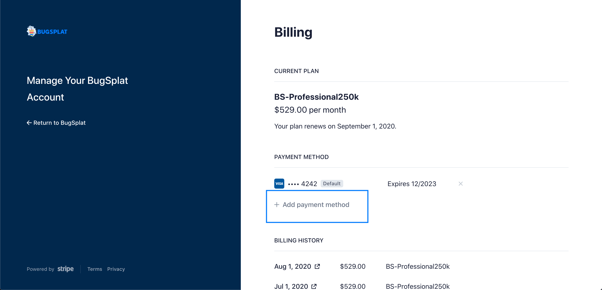

# Legacy Plans Guide


The information found in this document pertains only to BugSplat users who signed up for paid plans before March 15th, 2022.


Beginning March 15th, 2022 BugSplat instituted a new pricing structure which can be viewed on our [Plans](https://www.bugsplat.com/plans) page. &#x20;

If you are on a legacy plan you are grandfathered into that plan and no action is required on your end.

If you would like to speak directly with someone about your legacy account, or about our expanded pricing options now available, please send a note to [sales@bugsplat.com](mailto:sales@bugsplat.com).

### I'm on a Legacy plan, will I need to upgrade to the new pricing model?

Users who signed up before March 15th, 2022 are grandfathered into their current plan are not required to upgrade to the new billing structure.

### Viewing Billing History and Past Invoices

For customers who pay via credit card, it’s easy to access and download documents associated with billing history.

To do so, navigate to the [Billing](https://app.bugsplat.com/v2/settings/company/billing) page in Settings and click on the link that says **Update Card**

 (1).png>)

On the next page, you can view or download previous invoices. Simply scroll down the page and click on any month under the heading **Invoice History**.

This only works for users who are paying for BugSplat monthly via a credit card.

Can’t find exactly what you’re looking for? Send us a note at email [sales@bugsplat.com](mailto:sales@bugsplat.com) and we’ll be more than happy to help.

### Updating information associated with your legacy account

Upgrading the credit card, address, VAT, or email associated with your BugSplat account is easy. To do so, navigate to the [Billing](https://app.bugsplat.com/v2/settings/company/billing) page in Settings and click on the link that says **Update Card**.

.png>)

Next, click the button that says **+ Add payment method** and enter a new credit card. Make sure the box below the space to enter your card details is checked, designating the new card as the default card on the account.

Once updated will see the change reflected on the page shown in the image above.

This only works for users who are paying for BugSplat monthly via a credit card.

If you have any questions or want further confirmation, please email [sales](mailto:sales@bugsplat.com).

### Upgrading Legacy Pricing Plans

BugSplat Legacy plans provided a variety of monthly pricing options for users which you can see below.

These plans can be paid for monthly with a credit card, or they can be paid for annually via an invoice (saving 5%).

These plans are no longer available for purchase starting March 15th, 2022.  However, if your account is currently governed by a Legacy plan because you signed up for a paid account before March 2022,  please email [sales](mailto:sales@bugsplat.com) for any assistance you might need.  You still qualify for these plans.

| Annual Crash Volume | Monthly Cost | Annual Cost (Save 5%) | Users     | Full-feature |
| ------------------- | ------------ | --------------------- | --------- | ------------ |
| 15,000              | $0           | $0                    | 1         | No           |
| 25,000              | $49          | $44                   | 3         | No           |
| 50,000              | $139         | $125                  | 10        | No           |
| 125,000             | $259         | $233                  | 20        | Yes          |
| 250,000             | $529         | $502                  | 40        | Yes          |
| Enterprise          | Volume Based | -                     | Unlimited |              |

### Automated Upgrades for Legacy plans

If your account has exceeded its plan limits - users or annual allotted crash volume - then you will be automatically upgraded to a plan which covers your usage.

To qualify for an upgrade an account has to exceed both the monthly and annual crash limit in the same month.

When this happens, the account admin (change admin email instructions [here](../introduction/user-permissions.md)) will get an email letting you know that your plan has changed. The [Billing](https://app.bugsplat.com/v2/settings/company/billing) page and your next invoice will both reflect this upgrade.

You will have 30 days before your account is charged for the larger plan, which gives your team a window to get back into compliance and set your account back to its original setting (which can be accomplished on the [Account](https://app.bugsplat.com/v2/account) page).

You can see your usage on the [Billing](https://app.bugsplat.com/v2/settings/company/billing) page in Settings. If anything is in 'red' then it means that you're over your limit.

Have users that don't need access any longer? Delete them! Don't use an old database anymore - feel free to [retire it](../../introduction/production/managing-versions.md).

If you believe you shouldn't have been upgraded please view our [Fair-Refund](refund-policy.md) policy and then [contact us.](mailto:sales@bugsplat.com)

If you think that you need to upgrade to an Enterprise plan [send us a note](mailto:sales@bugsplat.com).
