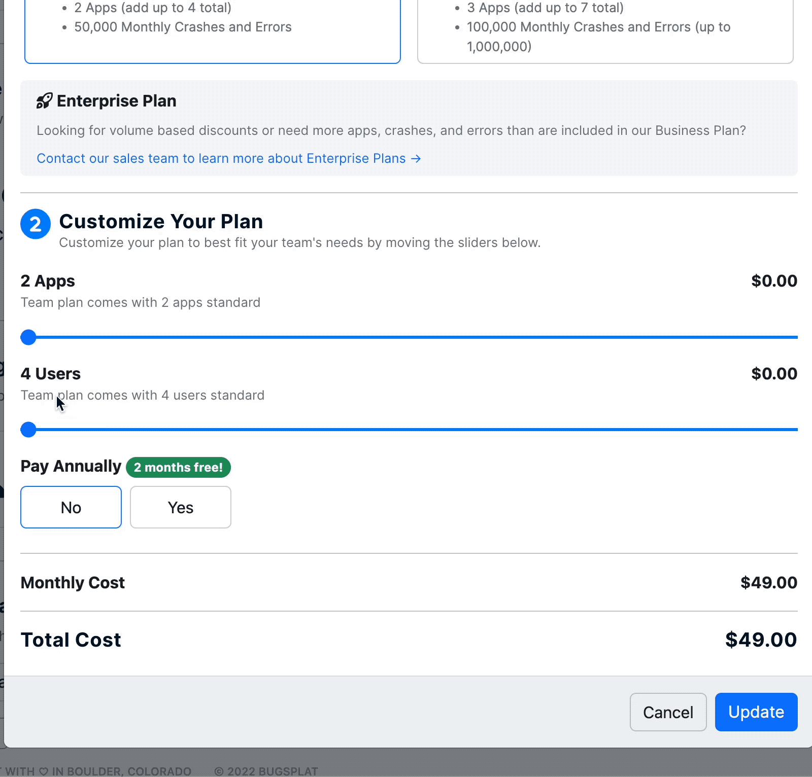

# Adding Additional Users and Apps to Your Plan

For both the Team and Business plans, non-restricted users can add additional User seats and Apps to their BugSplat plan.

To do that, navigate to the [Billing](https://app.bugsplat.com/v2/settings/company/billing) page and click the button labeled 'Update Plan.' This will bring up a pop-up that allows you to use a slide to select more User seats and Apps to add to your account.

Once you've selected the desired amount of seats, click the button 'Update,' and the changes will become live.

<figure><figcaption></figcaption></figure>

Note that currently, this function is only available for customers paying monthly.  \
