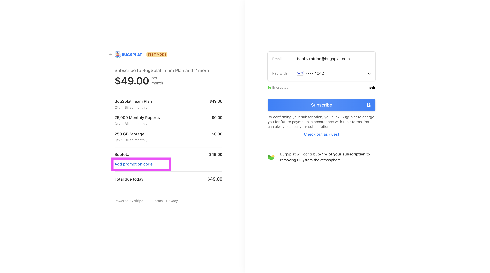

# Using Coupons and Promotions at BugSplat

In software development, every little bit helps, right? That's our thinking at BugSplat. We appreciate the work you do, so we sprinkle in some deals to make your day a bit brighter. Promotions and coupons are just our way of giving a nod to the awesome developers who choose us for their crash reporting needs. Here’s how you snag those savings, straightforward and simple, because every bit of savings counts.

**Applying Your Promotion Code**

1. **During Checkout:** When you're ready to upgrade your plan or kick off a new subscription, you'll find yourself at our straightforward checkout page. This is your gateway to savings.
2.  **Locating the Promo Field:** Keep an eye out for the 'Add promotion code' option. You'll find this gem right below the 'Subtotal' in your order summary. It's hard to miss.

    <figure><figcaption></figcaption></figure>
3. **Applying Your Code:** Enter your promotion code into the designated field and hit apply. Our system will then verify the code's validity. Upon successful application, you'll notice the plan information above adjusts to mirror the perks of your coupon deal, ensuring transparency and satisfaction before you proceed to payment.

**Trouble in Paradise?**

Sometimes tech has its quirks, and coupon codes are no exception. If you're experiencing any hitches with applying your promotion, or if the discount isn't reflecting as anticipated:

* **Reach Out:** Don’t fret. Simply drop us a line at sales@bugsplat.com. Whether it’s a hiccup in the system or just a query about the promotion's terms, we’re on standby to assist and make sure you secure your deserved discount.
