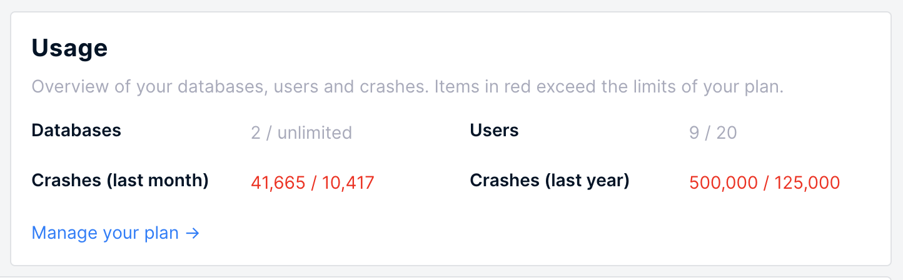

# Annual Plan Upgrades

If your account has exceeded its plan limits - for plans paying annual only crash volume matters - then you will be automatically upgraded to a plan which covers your usage.

BugSplat will only inquire about upgrading annual accounts when an account has exceeded its monthly volume limit and its annual volume limit.   

You can see your usage on the [Company](https://app.bugsplat.com/v2/company) page. If anything is in 'red' then it means that you're over your limit.

When an account that pays annually is out of compliance \(as shown above\) a member of the BugSplat sales team will reach out and discuss upgrading to a plan that better fits the user's new crash volume. 

Note that this increase must be a sustained crash volume increase - we are forgiving of crash spikes and seak to put all our users on plans they deem fair.

