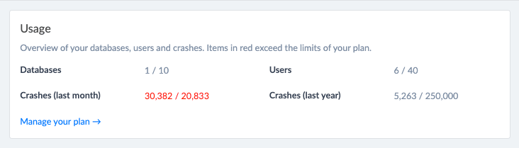

# Monthly Plan Upgrades

If your account has exceeded its plan limits - users or annual allotted crash volume - then you will be automatically upgraded to a plan which covers your usage.

To qualify for an upgrade an account has to exceed both it's monthly and annual limit in the same month.

When this happens, the account admin \(change admin email instructions [here](../billing-and-plan-managment/updating-email-address-for-receipts-and-invocies.md) \) will get an email letting you know that your plan has changed. Your [Account](https://app.bugsplat.com/v2/account) page and your next invoice will both reflect this upgrade.

This means is that you'll have 30 days before your account is charged for the larger plan, giving your team a window to get back into compliance and set your account back to its original setting \(which can be accomplished on the [Account](https://app.bugsplat.com/v2/account) page\).

You can see your usage on the [Company](https://app.bugsplat.com/v2/company) page. If anything is in 'red' then it means that you're over your limit.

Have users that don't need access any longer? Delete them! Don't use an old database anymore - feel free to [retire it](../../../introduction/production/how-to-stop-reporting-versions-of-an-application.md).

If you believe you shouldn't have been upgraded please view our [Fair-Refund](refund-policy.md) policy and then [contact us.](mailto:sales@bugsplat.com)

If you think that you need to upgrade to an Enterprise plan [send us a note](mailto:sales@bugsplat.com).

To learn more you can visit our [pricing page](https://www.bugsplat.com/plans).

