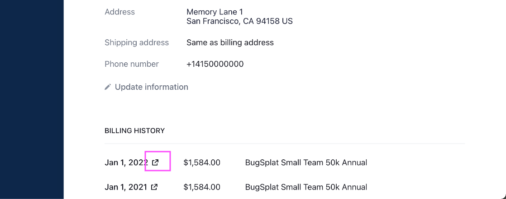

# Updating Credit Card and Billing Information and Viewing Billing History

Current account holders interested in updating their plan to a different level (Team or Business), adjusting the number of monthly reports, or adding/subtracting users and databases, should navigate to the [Billing](https://app.bugsplat.com/v2/company/billing) page in Settings and click on the button that says Update Plan Details.

Note that if you do not see an option to navigate to the Billing page it's likely because you are a Restricted Users. Please contact a [Non-Restricted](../../introduction/user-permissions.md) user on your team to gain access to [Billing](../).

{Insert Image}

This will bring up the Set Plan Details pop-up where account holders can update key settings for their account.

Once the desired change has been made click '{Button Name}' to confirm the changes.

## Adding or Updating Payment Specific Information

Current account holders interested in updating information associated with their account can do so by navigating to the [Billing](https://app.bugsplat.com/v2/company/billing) page in Settings and clicking on the link that says 'Manage your plan.'

This will bring you to the plan management portal where users can manage their account details.

Here, account holders can update their credit card, billing address, and email that receives billing information. This page is also where account holders can add VAT information.

### View and Download Billing History (Invoices and Receipts)

Account holders who wish to update their account information can do so by navigating to the [Billing](https://app.bugsplat.com/v2/company/billing) page in Settings. On this page, click on the button labeled 'Manage your plan' or 'Update Card'.

Clicking this button will redirect you to a Stripe-hosted page where you can make changes to your account, such as updating your plan, payment method, and associated email, and accessing previous receipts and invoices from your billing history. To access these documents, click on the Share icon (highlighted in a pink box below).

<figure><figcaption>
Click the share icon to view invoices for that payment period.
</figcaption></figure>
