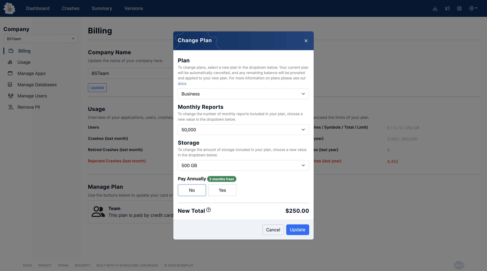

# Upgrading or Downgrading Your Plan

At BugSplat, we're committed to supporting the dynamic needs of your projects. Whether you're experiencing growth or adjusting project scopes, you have the flexibility to upgrade or downgrade your plan at any point during your billing cycle.

**How to Make Changes:** To alter your plan, navigate to the [Billing page](https://app.bugsplat.com/v2/company/billing) in your BugSplat account and click "Update Plan." This allows you to adjust crucial aspects of your service, including the plan type, monthly crash & error volume, and storage capacity to suit your project's requirements. Additionally, for those looking to optimize budgeting, switching to an annual payment offers savings and convenience.

**Integration of Plan Changes:** Adjustments to your plan, whether upgrades or downgrades, are seamlessly integrated into your current billing cycle, with pro-rated billing ensuring you only pay for what you use. Upgrades take effect immediately, offering instant access to expanded features or limits, while any unused portion of your plan is credited to your account.

<figure><figcaption></figcaption></figure>

**Considerations for Downgrading:** Downgrading is contingent upon your account's usage meeting the lower plan's criteria. For example, an account with users exceeding the limit of a smaller plan would need adjustments before a downgrade can be processed, ensuring compatibility with your selected plan.

**Transitioning to Enterprise:** For projects requiring advanced features and customization, our Enterprise plans provide a solution tailored to large-scale needs. Contact our team at sales@bugsplat.com to explore options that align with the complexity and scale of your endeavors

**Our Refund Policy:** We stand behind our service with a [fair refund policy](../plans-upgrades-and-payments-faq/refund-policy.md), providing additional peace of mind as you make changes to your subscription. This policy is designed to ensure your satisfaction with BugSplat, no matter how your project needs evolve.

By offering these flexible options, we aim to ensure that BugSplat continues to be a valuable tool in your software development toolkit, adaptable to the changing dynamics of your projects. If you have any questions or need further clarification as you consider changing your plan, please don’t hesitate to reach out.
