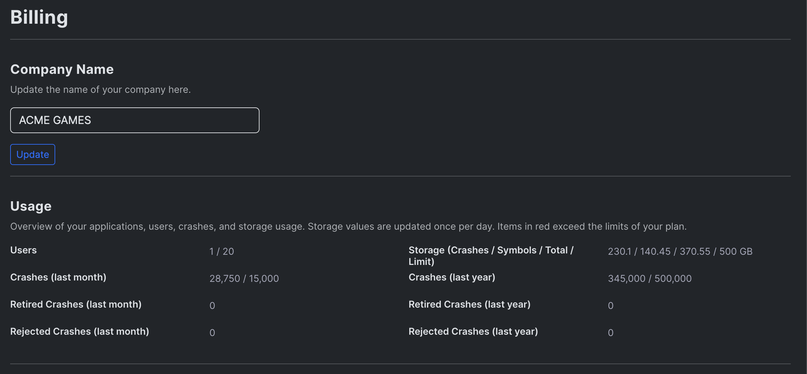
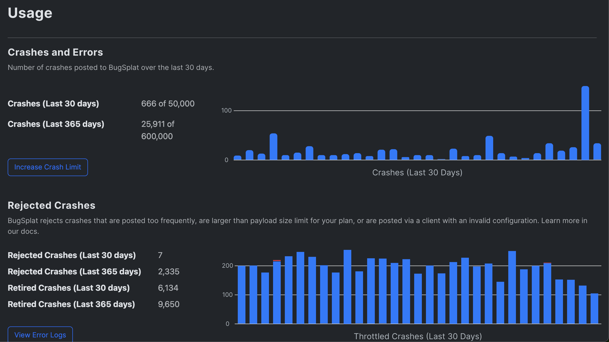

# Viewing Account Usage

#### Overview

Understanding your account usage is essential for optimizing your BugSplat plan and ensuring smooth crash reporting. BugSplat provides detailed insights into your usage through the **Billing Page** and the **Usage Page**.

***

#### Billing Page: Overview at a Glance

The [**Billing Page**](https://app.bugsplat.com/v2/company/billing) is your starting point for monitoring account usage and managing your plan. Here’s what you can find:

<figure><figcaption></figcaption></figure>

* **Monthly and Annual Crash Limits**: See the total number of crashes allowed and how many you've used.
* **Storage Usage**: Monitor your current storage usage compared to your plan’s limit.
* **Number of Users**: View the number of users included in your account.
* **Plan Details**: Identify your current plan type and manage upgrades or changes if you exceed your limits or need more crashes or storage.

To [adjust your plan](upgrading-changing-or-canceling-your-plan/upgrading-or-downgrading-your-plan.md), click on the upgrade options available. Learn more about upgrading here.

***

#### Usage Page: Detailed Insights

For a deeper dive into your usage statistics, head over to the [**Usage Page**](https://app.bugsplat.com/v2/company/usage), where you’ll find:

<figure><figcaption></figcaption></figure>

* **Crash Overview**: Get a detailed breakdown of crashes, including accepted and[rejected crashes](../../introduction/getting-started/troubleshooting.md).
* **Storage Utilization**: Understand how your current storage is being used.
* **Trends and Patterns**: Spot patterns in crash volume and storage usage to better plan your needs.

***

#### Need Assistance?

If you have any questions about your account usage or need help understanding your limits, feel free to email us at support@bugsplat.com.

BugSplat is here to ensure you get the most out of your crash reporting tools!
