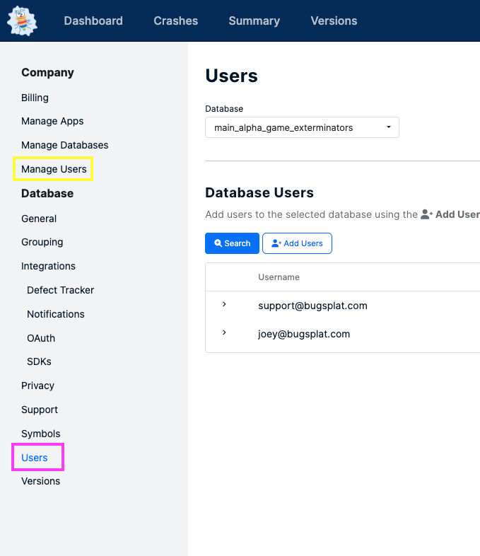

# Best Practices for Adding Users in Companies with Multiple Databases

### **Introduction:**&#x20;

Large companies and teams with multiple databases may have a need to restrict access to certain databases while allowing access to others. In order to manage access to databases effectively, it is important to establish best practices for adding users to individual databases.

### Best Practices:

* Ask team members to add users via the Database-specific [Users](https://app.bugsplat.com/v2/settings/database/users?database) page (outlined below in pink) instead of the Company-wide [Manage Users](https://app.bugsplat.com/v2/settings/company/users) page (outlined below in yellow)
  * Users added via the Database-specific Users page will only get access to that individual Database
* Limit non-restricted users' (admins) access to multiple databases
  * When a non-restricted user sends an invite via the Manage Users page, they, by default, give access to all the databases they have unrestricted access to
  * Users added by non-restricted users are be set by default as restricted

<figure><figcaption></figcaption></figure>

### Conclusion:&#x20;

Managing user access in large companies with multiple databases is crucial to ensure privacy, security, and compliance. By following these best practices, companies can avoid potential issues and ensure that users only have access to the databases they need.
