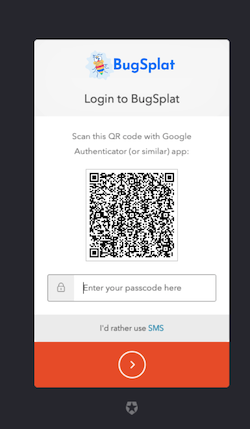

# Multi-Factor Authentication (MFA)

Multi-Factor Authentication (MFA) is a two-step login protocol requiring separate verification from a mobile device to access your account.  To enable MFA, simply visit the [Profile](https://app.bugsplat.com/v2/profile) page by clicking your name at the bottom of the left sidebar, then open the Security tab. Once there, click the Enable MFA button. &#x20;

Clicking Enable MFA opens a Configure MFA dialog showing a QR code and a code field. Scan the QR code with your third-party authenticator device, enter the resulting code, and click Verify in order to fully set up MFA for your account.&#x20;

&#x20;

