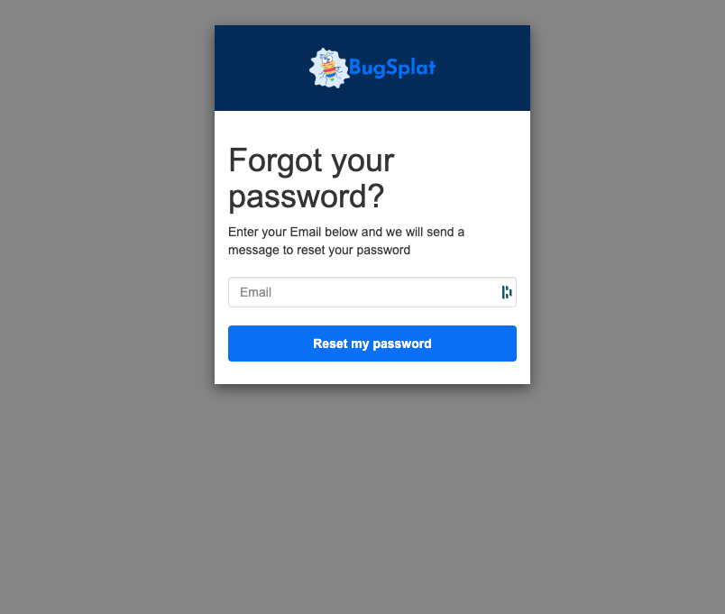
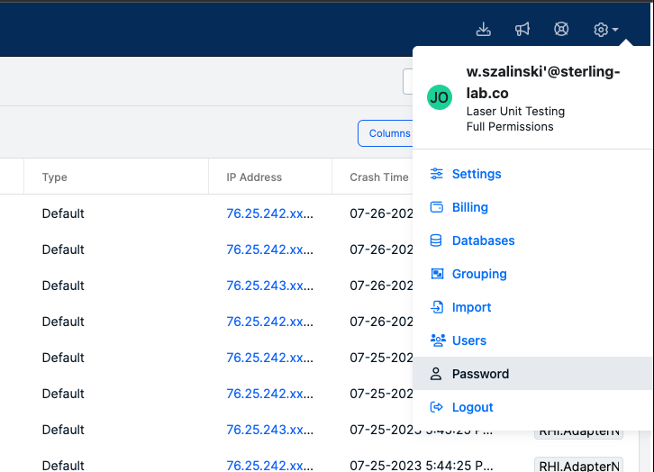

# Password Settings and Reset Options


**Required Password Reset (August 4th, 2023):** All BugSplat users must reset the password associated with their BugSplat account. Emails containing a password reset link have been sent to all users. If you missed that email, please visit our [new login page](https://app.bugsplat.com/cognito/login) and follow the steps below for '[Resetting a forgotten password.](https://app.gitbook.com/o/-LBMgmIbZKqjzfg08G3A/s/-LBMgmIcgkIXSUfnXDSv/\~/changes/548/administration/introduction/password-settings-and-reset-options#updating-passwords)'   Note users who log in using only Google or GitHub are not affected.


BugSplat takes your security seriously and is always working to improve.  Please see our [Security Program](../../introduction/production/security-privacy-and-compliance/security-program.md) for more details on how we keep you and your data safe.  Also, check out our documentation on [MFA](multi-factor-authentication-mfa.md) and [SSO](single-sign-on-sso.md) to learn more about advanced security options.

### **Setting your password**:

Users are requested to create a password when they create an account with BugSplat.  BugSplat requires strong, unique passwords.  Specific requirements will be shown on the account creation page.

### **Updating passwords**

* **Resetting a forgotten password**:  The BugSplat [login page](https://app.bugsplat.com/cognito/login) has a link labeled 'Forgot your password?' which will allow users to reset their password through a familiar set of steps. If you have any issues, please reach out to [support@bugsplat.com](mailto:support@bugsplat.com).
  *   The password reset page looks like this:&#x20;

      <figure><figcaption></figcaption></figure>
*   **Resetting a password inside the app**: Users who are currently logged into the app can reset their password by navigating to the '[Password](https://app.bugsplat.com/v2/password)' page under the Options dropdown tab. Select the button that says 'Reset Password'.

    <figure><figcaption></figcaption></figure>

