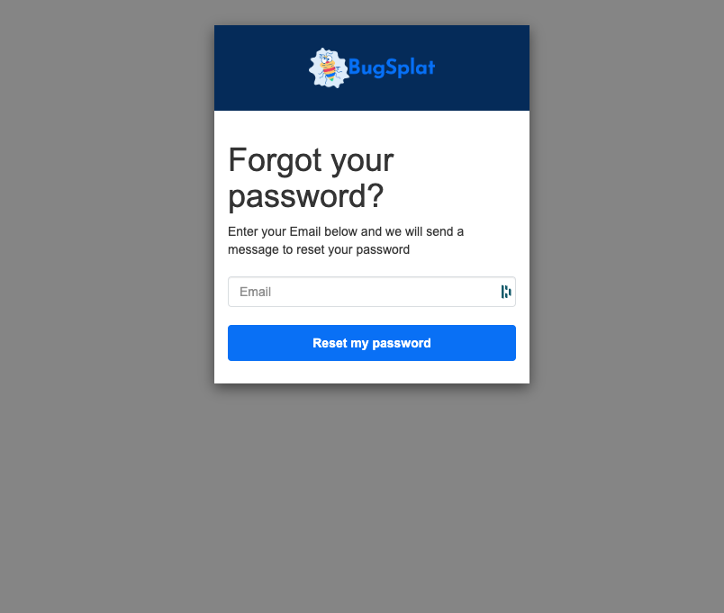
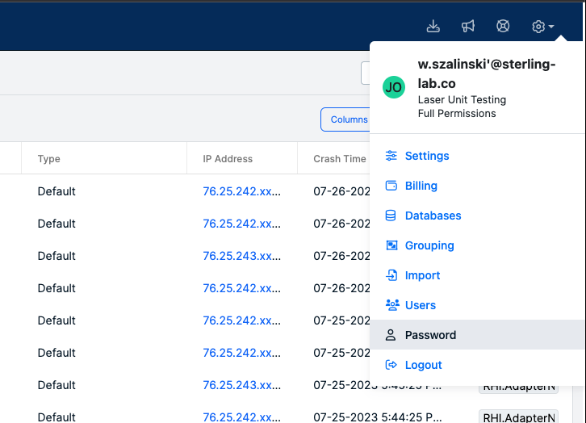

# Password Settings and Reset Options

BugSplat takes your security seriously and is always working to improve.  Please see our [Security Program](../../../introduction/production/security-privacy-and-compliance/security-program.md) for more details on how we keep you and your data safe.  Also, check out our documentation on [MFA](../multi-factor-authentication-mfa.md) and [SSO](../single-sign-on-sso.md) to learn more about advanced security options.

### **Setting your password**:

Users are requested to create a password when they create an account with BugSplat.  BugSplat requires strong, unique passwords.  Specific requirements will be shown on the account creation page.

### **Updating passwords**

* **Resetting a forgotten password**:  The BugSplat [login page](https://app.bugsplat.com/cognito/login) has a link labeled 'Forgot your password?' which will allow users to reset their password through a familiar set of steps. If you have any issues, please reach out to [support@bugsplat.com](mailto:support@bugsplat.com).
  *   The password reset page looks like this:&#x20;

      <figure><figcaption></figcaption></figure>
*   **Resetting a password inside the app**: Users who are currently logged into the app can reset their password by navigating to their Profile (via the avatar/name link in the sidebar), selecting the 'Security' tab, and using the 'Change Password' section. Select the button that says 'Update Password'.

    <figure><figcaption></figcaption></figure>

