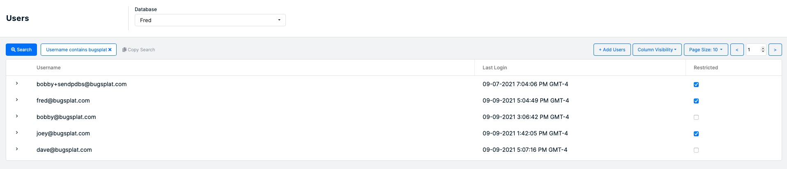

# User Permissions

There are lots of reasons you may want to restrict some of the users with access to your BugSplat account. Large Teams sometimes find that only a small part of their team needs unrestricted access to the BugSplat account. Similarly, if you work with a lot of consultants or contractors, you may want to limit the scope of their abilities inside of the app.

Luckily, restricting Users is simple and can be done by any Unrestricted users via the [Users](https://app.bugsplat.com/v2/users) page.

A user with 'Restricted' privileges will no longer be able to make changes to databases, update options, change pricing plans, or add users other users.

