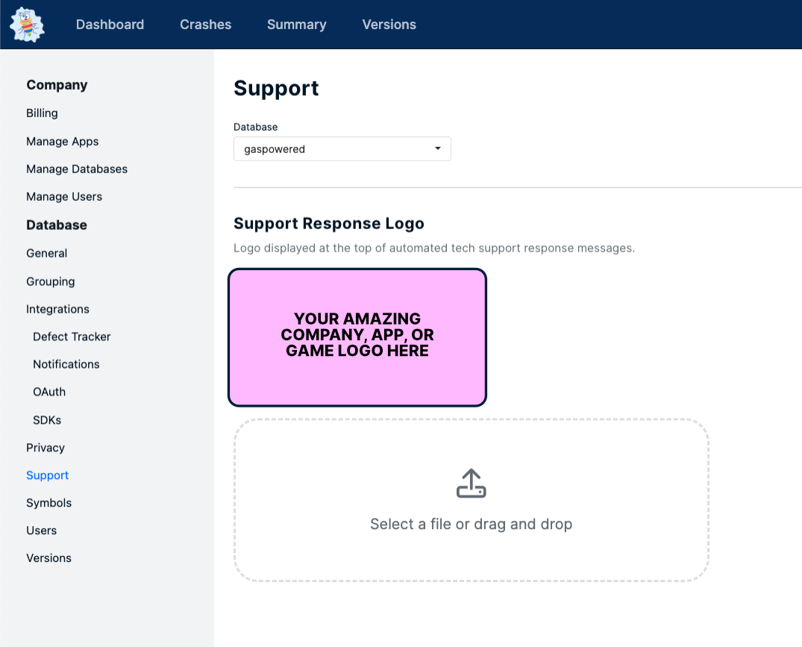

# Add Custom Branding to Support Response

One of the key benefits of using BugSplat for crash reporting is the ability to customize support messages with your branding. By uploading your own custom logo via the Support page in the BugSplat app ([https://app.bugsplat.com/v2/database/support?database=](https://app.bugsplat.com/v2/database/support?database=)), you can create a consistent brand identity for your customers. If you don't upload a custom logo, the BugSplat logo will be displayed by default. This not only increases goodwill with users when they experience a crash, but also helps to establish your brand as a reliable source of support.

<figure><figcaption>
Upload Logo Here
</figcaption></figure>

In addition to uploading your logo, BugSplat also enables you to create unique support responses for different crash types. This means you can guide users through troubleshooting steps specific to their issue, increasing the likelihood of a successful resolution. To learn more about Custom Support Responses and how they can benefit your organization, visit our larger Custom Support Responses page.

In conclusion, using BugSplat for software crash reporting provides a range of advantages, including the ability to customize support messages with your branding. By uploading your logo via the Support page, you can create a consistent brand experience for your users and establish your brand as a reliable source of support. So, consider using BugSplat for your software crash reporting needs today.

BugSplat allows users to customize support messages with their branding and create unique support responses for different crash types, increasing the likelihood of successful troubleshooting.

<figure><figcaption></figcaption></figure>
