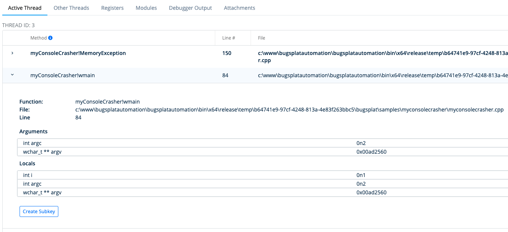

# Crash Details Active Thread

The **Method** column contains a list of methods in the stack trace of the thread that caused your program to crash. Depending on the [platform](../../introduction/getting-started/integrations/) you may see methods that don't match your source code. This is because platforms such as [Windows Native](../../introduction/getting-started/integrations/desktop/cplusplus/), [.NET Framework](../../introduction/getting-started/integrations/desktop/windows-dot-net-framework.md), [Crashpad](../../introduction/getting-started/integrations/cross-platform/crashpad/), [Breakpad](../../introduction/getting-started/integrations/cross-platform/breakpad.md), [macOS](../../introduction/getting-started/integrations/desktop/macos.md), [Unity](../../introduction/getting-started/integrations/game-development/unity.md), and [Unreal](../../introduction/getting-started/integrations/game-development/unreal-engine.md) require you to upload [symbols](../../introduction/development/working-with-symbol-files/) for each version you release in order to calculate the correct method names. For more information on how to upload symbols please see the documentation for your [platform](../../introduction/getting-started/integrations/).

Clicking the **&gt;** \(greater than symbol\) in the left-most column will expand the **Row Details** view.

The **Row Details** view will display the **Create Subkey** button that will allow you to create a [subkey](../../introduction/development/using-subkeying-to-find-difficult-crashes.md). Grouping at a different level of the call stack is called [subkeying](../../introduction/development/using-subkeying-to-find-difficult-crashes.md) and is useful in cases such as a crash that occurs in a 3rd party library, or when additional stack frames are added by a crash reporter.

Additionally, for [Windows Native](../../introduction/getting-started/integrations/desktop/cplusplus/) crashes the **Row Details** view will show a table of [Local Variables and Function Arguments.](https://www.bugsplat.com/resources/development/local-variables-function-arguments/)

