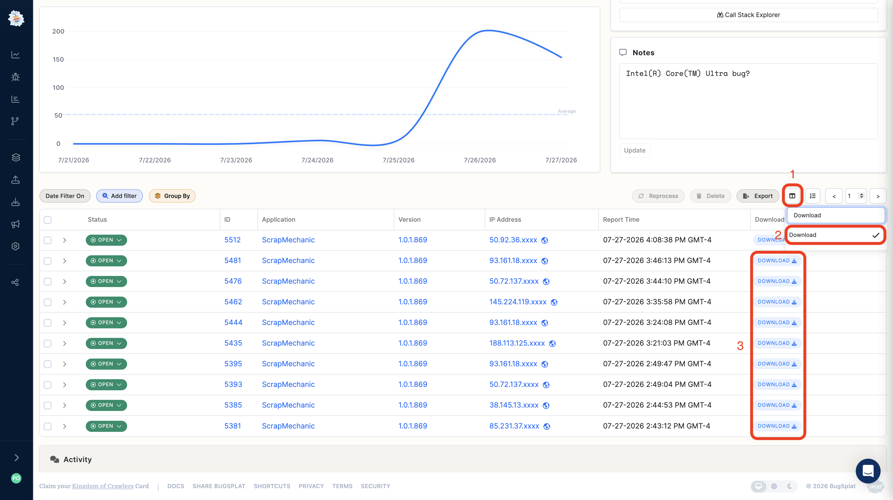

# How Do I Download Crash Attachments in Bulk?

BugSplat stores each crash report as a zip file that contains the crash file, such as a minidump, along with every attachment that was posted with it. If you need those files outside of BugSplat, you can grab them a row at a time from the app, or fetch them programmatically with the API.

## Download from the app

The **Download** column contains a link that downloads a crash and its attachments as a single zip file. The column is available on the [Crashes](https://app.bugsplat.com/v2/crashes) page and the Crash Group page, and it's hidden by default. To show it:

1. Click the **Column Visibility** control above the top right corner of the table.
2. Check **Download**.
3. Click **DOWNLOAD** on any row to save that crash's zip file.

<figure><figcaption>
Enabling the Download column on the Crash Group page
</figcaption></figure>

Narrow the table with [Searching](../../introduction/development/searching/search.md), [Grouping](../../introduction/development/searching/grouping.md), or the **Timeframe** filter before you start, so the rows you download are the ones you care about.

If you only need one file rather than the whole zip, open the crash and use the **Attachments** tab described in [Using the App](../../introduction/development/using-the-app.md#previewing-attached-files).

## Download with the API

To pull attachments for many crashes at once, script it against BugSplat's API:

1. Call the [Crashes](../../introduction/development/web-services/api/crashes.md) endpoint to list the crashes you're interested in. It supports [paging, filtering, and grouping](../../introduction/development/web-services/paging-filtering-and-grouping.md), so you can limit the results to a specific application, version, or date range.
2. For each `id` in the response, call the [Crash](../../introduction/development/web-services/api/crash.md#get-crash) endpoint.
3. Download the zip from the pre-signed URL in the `dumpfile` property of the response. The zip contains the crash file and all of its attachments. Pre-signed URLs are short lived, so download the file shortly after you request the crash details.


API access requires an [OAuth2](../../introduction/development/web-services/oauth2.md) token with the **restricted** scope, and is available on the Business and Enterprise [plans](https://www.bugsplat.com/pricing/).


If you're not sure how to get started, or you need to export more data than these options allow, please send us a note at [support@bugsplat.com](mailto:support@bugsplat.com).
