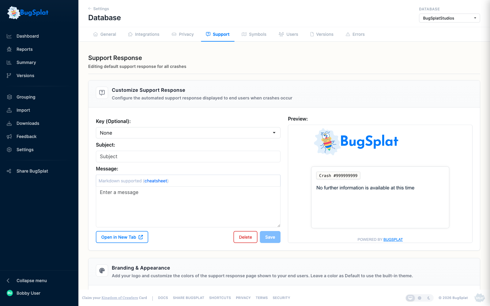
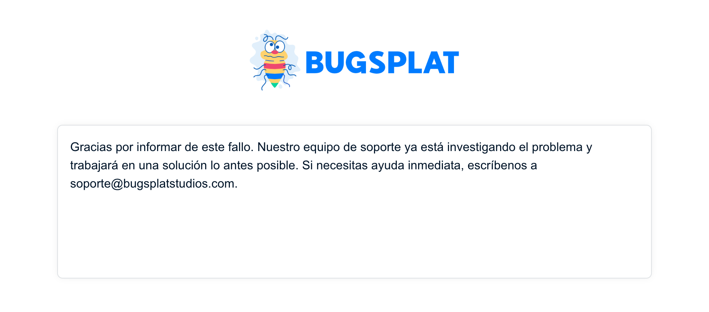

# Localized Support Responses for Windows C++, .NET, and macOS

BugSplat's Support Response feature allows developers to display a localized message to their users at the time of a crash.


**This is about the support message, not the dialog's own text.** The words on the Windows crash dialog itself — labels, buttons, body copy — come from `theme\strings.<bcp47>.json`, and `BugSplatReporter.exe` picks the file matching the end user's own Windows UI language with no configuration at all. The key described below is a separate thing: it is a value **you** choose and set in code, and it selects which support response your database returns. See [Crash Dialog Branding](../how-tos/customize-the-crash-dialog.md#adding-a-language) for translating the dialog.
 The Support Response feature is currently supported by our [Windows C++](../../introduction/getting-started/integrations/desktop/cplusplus/), [.NET Framework](../../introduction/getting-started/integrations/desktop/windows-dot-net-framework.md), and [macOS](../../introduction/getting-started/integrations/desktop/macos.md) integrations and support for other platforms is coming soon. The following steps will allow you to create a localized Support Response message for all crashes in your database. These same steps can be applied to create localized [stack key specific Support Response](../../introduction/production/setting-up-custom-support-responses.md#creating-a-crash-specific-support-response) messages as well.

## Step 1

Log in to the web application and navigate to the [Support Response](https://app.bugsplat.com/v2/support?stackKeyId=0&key=*Default*) page to edit the default support response for your database

## Step 2

Create a new key for the localized version of your support message by typing a value in the key field. You'll want to remember what you typed here for later.

## Step 3

Enter a subject for your support message. This subject is for internal use only and will not be displayed to the customer.

## Step 4

In the code you use to initialize BugSplat, provide the value you used for key from step 2.



**Windows C++**

The key is set with `SetKey` after the `BugSplat` instance is constructed.

```cpp
BugSplat g_BugSplat(L"Fred", L"myConsoleCrasher", L"1.0");
g_BugSplat.SetKey(L"es-ES");
```

If you're using the dynamic library and the C API, call `BugSplat_SetKey` instead:

```cpp
BugSplat_Init(L"Fred", L"myConsoleCrasher", L"1.0");
BugSplat_SetKey(L"es-ES");
```

**.NET**

```text
BugSplat.CrashReporter.Init("Fred", "myDotNetCrasher", "1.0");
BugSplat.CrashReporter.AppIdentifier = "es-ES";
```

**Mac OS**

```text
- (NSString *)applicationKeyForBugsplatStartupManager:(BugsplatStartupManager *)bugsplatStartupManager signal:(NSString *)signal exceptionName:(NSString *)exceptionName exceptionReason:(NSString *)exceptionReason;
{
    return @"es-ES";
}
```

## **Step 5**

Generate a crash and ensure that the correct support response is loaded, you should see your translated message.



