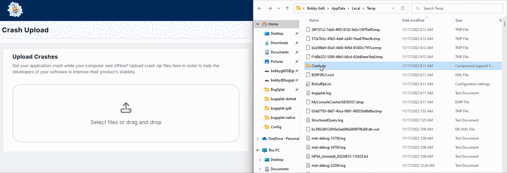

# Manually Upload Crash Reports to BugSplat

BugSplat's [Crash Upload](https://app.bugsplat.com/v2/upload) page allows users to upload a BugSplat crash report manually.

Uploading a report manually can be necessary, for example, when a crash occurs on a computer not connected to the Internet. When BugSplat can't upload the file automatically, the zip file containing the crash report data is displayed in the BugSplat crash report dialog.

To manually upload a crash report, browse for the zip file using the **Select Files** button or drag and drop the file on the [Crash Upload](https://app.bugsplat.com/v2/upload) page.

<figure><figcaption>
Upload a Crash via Drag and Drop
</figcaption></figure>
