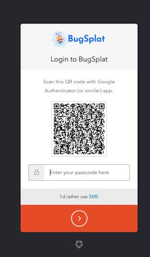

# Multi-Factor Authentication (MFA)

To enable Multi-Factor Authentication (MFA) two-step login protocol requiring separate verification from a mobile device to access your account, simply visit the [Password](https://app.bugsplat.com/v2/password) page found under the Settings dropdown.  Once there, toggle the Enable MFA button to the on position. &#x20;

Next, log out of your account by clicking the Logout button found at the bottom the Settings dropdown. &#x20;

Once logged out, begin the process of configuring MFA for your account by logging back into your account via the [Login](https://app.bugsplat.com/auth0/login) page.  After correctly entering your username and password you'll be presented with an option to configure your third-party device in order to fully set up MFA for your account.&#x20;

&#x20;

