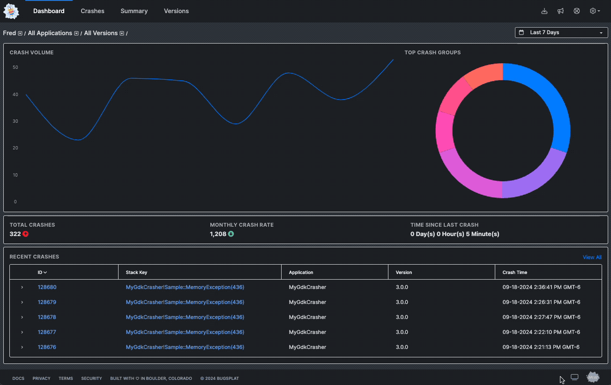

# Using Darkmode

BugSplat now offers a Dark Mode, providing a comfortable viewing experience, especially in low-light environments. This feature allows you to select your preferred theme: Match System Settings, Light Mode, or Dark Mode. Your choice will persist as a preference between sessions, giving you a consistent experience every time you log in.

**Changing the Theme**

You can easily switch between these modes yourself by following these steps:

1. Look for the theme icon located next to the 'Splat' logo in the footer on the bottom right of the page.
2. Click on the icon to open the theme selector.
3. Choose between:
   * **Match System Settings:** This mode will adapt BugSplat's appearance to your current operating system's light or dark mode.
   * **Light Mode:** Forces the interface into a light theme, regardless of your system settings.
   * **Dark Mode:** Enables a dark theme for the interface, perfect for nighttime work or low-light environments.

Check out the GIF below to see the theme switcher in action:

<figure><figcaption></figcaption></figure>

**Need Help?**

Dark Mode is a newly released feature, so if you encounter any issues or need assistance, please don't hesitate to reach out to us at support@bugsplat.com.
