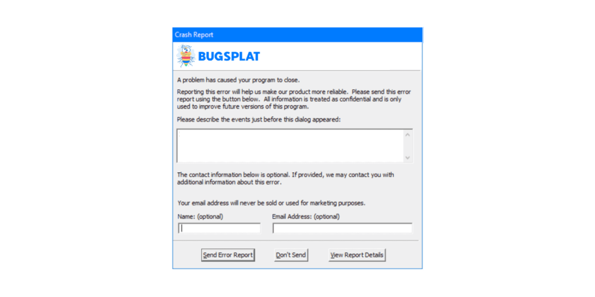

# What is a crash reporter?

A **crash reporter** is a software program that helps developers identify when, where, and how often a software application crashes to help diagnose and fix the underlying problem causing the crash.

Crash reporters are a valuable part of the software development lifecycle as they greatly simplify and improve developers' processes to fix bugs, defects, or other exceptions that cause application crashes.&#x20;

They perform this task automatically, capturing an application's state during the crash. This 'snapshot' often includes the collection of a minidump file, including the runtime stack of each active thread during the crash.

Access to this information allows developers to identify the underlying issue causing the application to crash without seeing it in real-time or recreating the issue on their own computers.&#x20;

Most people interact with a crash reporter via the [**dialog box**](../how-tos/customize-the-crash-dialog.md) (shown below) or the window that appears after an application crashes. This box provides basic information about what happened and gives the user a chance to provide additional details about the events leading up to the crash event.

<figure><figcaption>
Example BugSplat Crash Dialog
</figcaption></figure>

### A Critical Tool for Support

Crash reporters have become an increasingly common tool for developers and QA teams supporting deployed software applications.

With a crash reporter, teams can automatically record every instance of their application's crash history, ensuring that their dev and support teams have the best data to work with as they endeavor to support their application.&#x20;

Crash reporters often remove the need to review every crash manually as they intelligently group crashes that are similar or crashed because of the same defects into [crash groups](../../introduction/development/web-services/api/crash-groups.md). This allows people supporting the application to identify which crashes are happening more frequently, helping them to prioritize fixes based on impact to application performance.&#x20;

This means crash reporters can decrease the time and energy a team has to spend on support while also ensuring that they are improving the performance and stability of their application for their users. &#x20;

Crash reporters also serve the critical role of an early warning system for critical issues that users may encounter while using an application.  Many tools have the ability automatiaclly send customized alerts to via email or to messaging tools (e.g., [Slack](../../introduction/development/integrating-with-tools/messanger-apps/slack.md), [Teams](../../introduction/development/integrating-with-tools/messanger-apps/microsoft-teams.md), [Discord](../../introduction/development/integrating-with-tools/messanger-apps/discord.md)) that let developers know about critical issues before users can report them.

### A Boost to Development&#x20;

As crash reporters have become increasingly common as support tools, they have also become more popular as a part of the pre-release development process.&#x20;

Teams that take advantage of crash reporting during development can effectively identify and address defects in their code pre-launch. &#x20;

Crash reporters help teams automate identifying, logging, and fixing more crashes during testing. Often crash reporter tools - like [BugSplat](https://www.bugsplat.com) - integrate directly with a team's defect tracking tool (e.g., [Jira](../../introduction/development/integrating-with-tools/issue-trackers/jira.md) or [Github Issues](../../introduction/development/integrating-with-tools/issue-trackers/github-issues.md)) to further streamline the process of fixing bugs pre-launch. &#x20;

Because bugs are cheaper and easier to fix during development, leveraging a crash reporter to help identify and fix bugs before they're shipped effectively lowers development costs and improves the stability of shipped software.&#x20;

### Final Thoughts

Developers and support teams use crash reports like [BugSplat](https://www.bugsplat.com) to:&#x20;

* Understand the health of their software applications.&#x20;
* Improve the stability of their code
* Get early warnings when there's an issue that needs their attention&#x20;
* Spend less time and energy fixing defects&#x20;

Start using [BugSplat for free](../../administration/billing/free-trial.md). BugSplat works cross-platform ([25+ SDKs](../../introduction/getting-started/integrations/)), is [simple to setup](../../introduction/getting-started/) and configure, and our [support team](../../administration/contact-us.md) is top-notch.&#x20;

