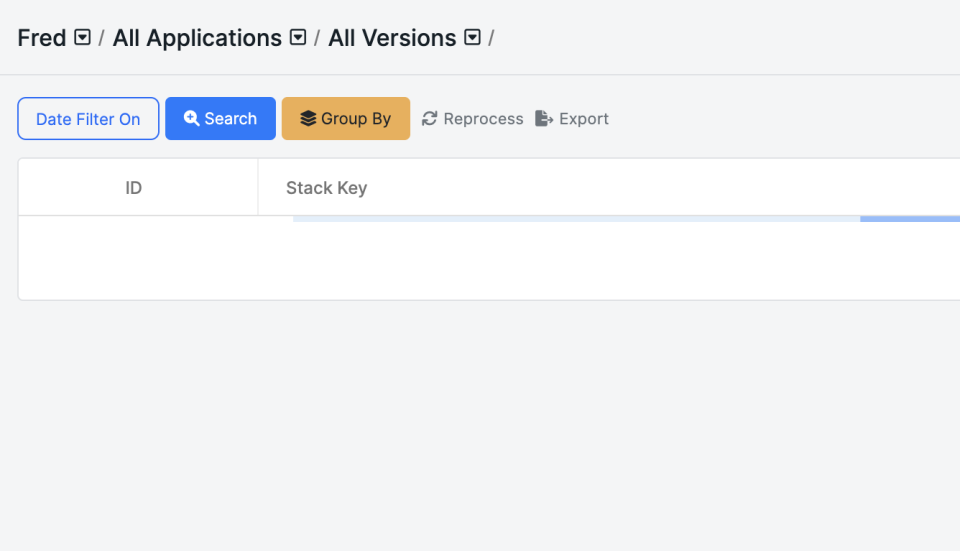

# Batch Reprocess Crashes

This guide will teach you how to reprocess multiple crashes simultaneously via the BugSplat UI. This new feature works in conjunction with the ability to [reprocess individual reports](reprocessing-crashes.md).

Reprocessing crashes is a valuable feature that lets you update crash reports when symbols are added after the crashes were initially reported, when auto-group rules have changed, or when other issues have occurred with a group of crashes.&#x20;

Follow these steps to learn how to batch reprocess crashes.

### How to Batch Reprocess Crashes


This feature is currently limited to a maximum of 50 crashes at a time and can take a few minutes to complete. Feel free to grab a coffee or answer an email while you wait.


Reprocessing crashes is a valuable tool for maintaining accurate and up-to-date crash information. Here's how to do it:

1. Select the group of crashes you'd like to reprocess via the [Crashes](https://app.bugsplat.com/v2/crashes) page.
2. Navigate to the [Crashes](https://app.bugsplat.com/v2/crashes) page and use the filter options or page size selectors to display the group of crashes you want to batch-reprocess.
3.  Click the **Reprocess** button located above the crashes table and next to the filter settings.

    

    <figure><figcaption>
Reprocess Button on Crashes Page
</figcaption></figure>

    

4.  Click **OK** to reprocess your reports. You will see that the selected reports are now `Pending...` in the crashes table.

    

    <figure><figcaption></figcaption></figure>

    

5. Review reprocessed crashes to see if this has fixed your issue.


Watch Reprocess in action!


### When to Use the Batch-Reprocess Function?

**Addition of Symbols:** When symbols are added after the crashes are reported, reprocessing ensures that the crash reports are properly updated with the latest symbol information. This is particularly useful when analyzing past crashes that lacked symbol details.

**Auto-Group Rule Changes:** Reprocessing is also valuable when there are modifications to the auto-group rules. By reprocessing the crashes, the system can reevaluate and group the crashes based on the updated rules, providing a more accurate representation of the crash data.

### Conclusion

That's it! By reprocessing crashes in the current view on BugSplat, you can easily apply updated symbols or new auto-group rules to your crash reports. Remember that reprocessing up to 50 crashes may take a few minutes, so feel free to grab a coffee or engage in other activities during this time.
