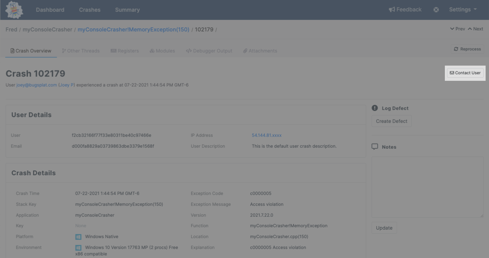

# Contacting End-Users

If a crash or error was submitted by an [end-user](../bugsplat-terminology.md#end-users), and that user included a valid email address as part of the submission, then it is possible to send an email to that end user regarding the crash by clicking the “Contact User” button \(below\).

If an email address hasn't been provided, or it has been obfuscated to protect customer information, then the **Contact User** button will be disabled. 

