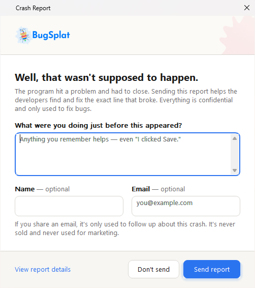
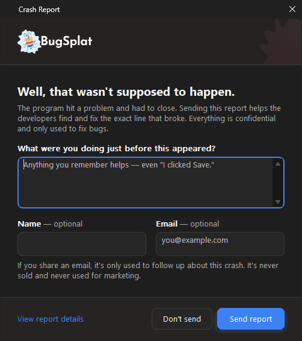
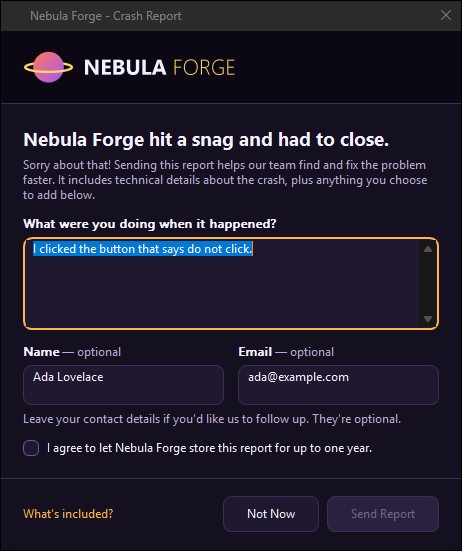

# Crash Dialog Branding

On Windows, the crash dialog your users see is shown by `BugSplatReporter.exe`. It reads its colors, fonts, layout, logo, and wording from a `BugSplatTheme` folder at run time. Nothing is compiled: edit a file, preview the dialog, and ship the folder with your application.


**Upgrading from BugSplat for Windows 8.x?** The theme folder replaces `BugSplatRc.dll`, which no longer exists in 9.0.0. If you customized the dialog by editing `BugSplatRc.rc` and rebuilding the DLL, those changes don't carry forward; re-create them in `theme.json` and `strings.en-US.json` as described below. See the [upgrade guide](../../introduction/getting-started/integrations/desktop/cplusplus/bugsplat-for-windows-upgrade-guide.md#upgrading-to-9.0.0).


For macOS, see the [Crash Reporter Customization](../../introduction/getting-started/integrations/desktop/macos.md#crash-reporter-customization) section of the macOS guide.

### The Default Dialog 👀

The dialog follows the end user's Windows light or dark mode:

<figure><figcaption><p>Light mode</p></figcaption></figure>

<figure><figcaption><p>Dark mode</p></figcaption></figure>

A theme can change the colors, type, sizes, logo, and wording. This fictional brand was made entirely with a `theme.json`, a logo PNG, and a string file:

<figure><figcaption><p>A custom theme</p></figcaption></figure>

### Where the Theme Lives 📁

`BugSplatReporter.exe` reads `BugSplatTheme\theme.json` and `BugSplatTheme\strings.<language>.json` from the folder it's in, which is your application's folder:

```
YourApp\
  YourApp.exe
  BugSplat.dll              only if you use the dynamic library
  BugSplatMonitor.exe
  BugSplatReporter.exe
  BugSplatWer.dll
  BugSplatTheme\
    theme.json              colors, type, layout, and switches
    strings.en-US.json      every word the dialog shows
    logo.png                optional, named by brand.logo
```

The whole folder is optional. The reporter has the defaults built in, and the `BugSplatTheme` folder in the SDK's `bin` folder is an exact copy of them, so shipping it unchanged, or not at all, gives the same dialog. Diff your files against the SDK's copy to see what you've changed.

`BugSplatMonitor.exe` starts the reporter with nothing but the crash folder, so in a shipped application the theme is always the `BugSplatTheme` folder next to `BugSplatReporter.exe`.

#### With the BugSplat NuGet Package

If your .NET application gets BugSplat from the [`BugSplat`](https://www.nuget.org/packages/BugSplat) NuGet package, don't copy anything by hand. Put the theme in a folder named `BugSplatTheme` next to your project file:

```
YourApp\
  YourApp.csproj
  BugSplatTheme\
    theme.json
    strings.en-US.json
    logo.png
```

The package copies the folder's contents, subfolders included, to `BugSplatTheme\` in your build output and `dotnet publish` folder, next to `BugSplatReporter.exe`. A single-file publish leaves it as a loose folder, because the reporter is a separate process that reads it from disk. The package doesn't include a theme folder of its own, so without `BugSplatTheme` the dialog uses its built-in defaults.

To keep the theme somewhere else, set its path, relative to the project file:

```xml
<PropertyGroup>
  <BugSplatThemeDirectory>..\Branding\CrashDialog</BugSplatThemeDirectory>
</PropertyGroup>
```

If a folder named by `BugSplatThemeDirectory` doesn't exist, the build fails with `BSTHEME000` instead of quietly shipping the default dialog.

Every build on Windows also [checks the theme](#checking-a-theme) and reports each problem as a `BSTHEME001`–`BSTHEME005` warning. Add a code to `<NoWarn>` to silence that kind of warning, or set `<BugSplatCheckTheme>false</BugSplatCheckTheme>` to turn the check off.

The theme is copied whenever the native runtime is: for executables and test projects, and for a library that sets `<BugSplatCopyNativeFiles>true</BugSplatCopyNativeFiles>`. A library loaded by a native host gets the theme in its own output's `BugSplatTheme\` folder; deploy that folder next to the host's executable along with the native files. If you copy BugSplat's files to the host yourself instead, copy your theme folder there as `BugSplatTheme\` too. See [BugSplat for .NET](../../introduction/getting-started/integrations/desktop/bugsplat-for-dot-net.md).

### Previewing Your Changes 🔍

`BugSplatReporter.exe` has a preview mode. It shows the real dialog for a sample crash and **never uploads anything**, so you don't have to crash your application, or fill your database with test crashes, to check a color. The reporter never uploads in any mode — `BugSplatMonitor.exe` does that — and in preview it doesn't save the dialog's answers either, so it's safe to point at a real crash folder.

```batch
BugSplatReporter.exe --preview
BugSplatReporter.exe --preview --theme "C:\work\my-theme"
BugSplatReporter.exe --preview --theme "C:\work\my-theme" --scale 200
BugSplatReporter.exe --preview --theme "C:\work\my-theme" --link-domains "example.com"
```

| Option | What it does |
| --- | --- |
| `--preview` | Shows the dialog for a built-in sample crash. Saves nothing and sends nothing. |
| `--theme <folder>` | Loads `theme.json` and the string files from this folder instead of the `BugSplatTheme` folder next to the reporter. Accepts the folder or the path to its `theme.json`. |
| `--scale <percent>` | Draws the dialog as if the display were at this scale, from 50 to 400, so you can check 150% and 200% without changing your display settings. Preview only. |
| `--link-domains <domains>` | Lets the dialog's links work for these domains, separated by semicolons, the way your application allows them in code. See [Links in the Dialog](#links-in-the-dialog). |

Before you ship a theme, check:

1. **Both appearances.** Even if you pin `appearance`, switch Windows between light and dark mode and look again. A logo with an opaque background, or a color you set for only one mode, shows up immediately.
2. **Contrast on the accent.** `accentText` is drawn on `accent`, not on `background`. A light accent needs a dark `accentText`.
3. **The focus ring.** Tab through every control. `focus` must be visible against `background`.
4. **Your longest language.** German runs roughly 35% longer than English. The dialog grows to fit, but look at what that means for your `windowWidth`.
5. **Display scaling.** Use `--scale 150` and `--scale 200`. A logo drawn at 1× looks soft at 2×.
6. **Keyboard shortcuts.** Two controls with the same `&` letter means one of them can't be reached from the keyboard.

### Checking a Theme ✅

A theme can change how the crash dialog looks, but it can never stop a crash report from being sent. The reporter ignores anything in a theme it can't use, such as a misspelled key, a color that isn't a color, or a logo it can't decode, and uses the default instead. That also makes mistakes easy to miss, so check the folder before you ship it:

```batch
BugSplatReporter.exe --check-theme "C:\work\my-theme" | more
```

`--check-theme` reads the folder the same way the dialog does, opens no window, and prints one line for each problem, in the format MSBuild reports as a warning:

```
C:\work\my-theme\theme.json: warning BSTHEME001: palette.light.accent is not #RGB, #RRGGBB or #RRGGBBAA; using the default
C:\work\my-theme\theme.json: warning BSTHEME002: layout.widht is not a key this version of the reporter reads; it is ignored
```

| Code | Problem |
| --- | --- |
| `BSTHEME001` | A value, or a whole section, in `theme.json` falls back to its default. |
| `BSTHEME002` | A key in `theme.json` or a string file that the reporter doesn't read, usually a typo. |
| `BSTHEME003` | `brand.logo` names a file that's missing, too large, or can't be decoded. |
| `BSTHEME004` | A string file, or a value in one, that the reporter ignores, including a link that could never work. |
| `BSTHEME005` | The folder has neither `theme.json` nor a string file. |

The exit code is `0` for any folder that exists, however many warnings it prints, `1` with no folder, and `2` when the folder doesn't exist. The reporter is a Windows program, so a console doesn't wait for its output: pipe it, to `more` in a command prompt or to `Out-Host` in PowerShell.

On an end user's machine, the same problems are written to `BugSplat.log` in the crash folder, prefixed `theme:` or `strings:`.

### Editing theme.json 🎨

Write only the keys you're changing; everything you leave out keeps its default. This is a complete theme:

```json
{
  "palette": {
    "light": { "accent": "#7A3E9D", "accentHover": "#8E4FB3" },
    "dark":  { "accent": "#B180D8", "accentText": "#1A1A1A" }
  },
  "brand": { "logo": "acme-logo.png" }
}
```

The file is plain JSON, up to 256 KB. Comments (`//` and `/* */`) aren't JSON, and a file containing them is ignored entirely. A theme can't name a program, a command, or a web address, so it can't make the reporter run or open anything.

#### Top Level

| Key | Default | Notes |
| --- | --- | --- |
| `schemaVersion` | `1` | The version of the format the file was written for. A file written for a newer version still loads; keys the reporter doesn't know are ignored. |
| `appearance` | `"system"` | `"system"` follows the end user's Windows light or dark mode. `"light"` or `"dark"` pins it. |

#### `brand`

| Key | Default | Notes |
| --- | --- | --- |
| `productName` | `"BugSplat"` | Available to string files as `{productName}`. Not shown on its own. |
| `logo` | `""` | An image file in the theme folder, drawn in the banner. `""` means BugSplat's logo. |
| `logoHeight` | `40` | Height, from 0 to 240, to fit the logo into. `0` means as tall as the banner allows. A logo is never enlarged beyond its own size. |
| `logoAlignment` | `"start"` | `"start"`, `"center"`, or `"end"`. `"start"` is the left edge in a left-to-right language. |

`logo` is the only key that names a file, so it's tightly restricted:

* It must be a plain file name in the theme folder: no `\`, `/`, `..`, drive letter, or network path.
* It must end in `.png`, `.jpg`, `.jpeg`, `.gif`, `.bmp`, `.tif`, or `.tiff`.
* The file must be 4 MB or smaller, and at most 8192 pixels on each side.
* It must decode within 3 seconds.

A logo that fails any check is replaced by BugSplat's logo. For best results, use a PNG with a transparent background, about three times the height you want so it stays sharp at 200% and 300% scaling, for example 1200 × 120 for a 40-pixel-high logo. A wide wordmark works better than a square mark, because the banner is a strip.

#### `palette`

Two objects, `light` and `dark`, with the same fifteen keys. Colors are `#RGB`, `#RRGGBB`, or `#RRGGBBAA`; the alpha is accepted but ignored. Color names and `rgb(...)` aren't accepted. You don't have to set both modes: set only `dark`, and light mode keeps the defaults.

| Key | Light | Dark | Where it's used |
| --- | --- | --- | --- |
| `background` | `#FFFFFF` | `#1E1E1E` | The dialog itself. |
| `surface` | `#FFFFFF` | `#262626` | Inside text fields and the file list, and secondary buttons. |
| `surfaceAlt` | `#F3F2EF` | `#303030` | A hovered or pressed secondary button, a disabled button or field. |
| `bannerBackground` | `#FBFAF6` | `#242321` | The strip the logo sits on. |
| `footerBackground` | `#F7F6F2` | `#252422` | The band along the bottom that holds the buttons. If a mode sets `background` but not `footerBackground`, the footer uses that `background`. |
| `textPrimary` | `#1A1A1A` | `#F5F5F5` | The headline, field labels, text in fields, and secondary button captions. |
| `textSecondary` | `#6B6B6B` | `#ABABAB` | Body text, the contact note, the "optional" hint, and placeholder text in empty fields. |
| `textDisabled` | `#A3A3A3` | `#6E6E6E` | A disabled button's caption. |
| `accent` | `#2B74F0` | `#3D82F5` | The **Send report** button, the **View report details** link, a checked consent box, and a focused field's outline. Not the links in `body` and `contactNote`, which use the Windows link color. |
| `accentHover` | `#1F64DB` | `#5A96F7` | The primary button and link under the pointer. |
| `accentPressed` | `#1A55BC` | `#2F6FD8` | The primary button and link while pressed. |
| `accentText` | `#FFFFFF` | `#FFFFFF` | Text and the check mark drawn on `accent`. |
| `border` | `#D9D7D2` | `#3D3C39` | Field and secondary button outlines, and the dividing lines. |
| `borderStrong` | `#A8A6A0` | `#6A6965` | A field or button under the pointer, and an unchecked consent box. |
| `focus` | `#1A1A1A` | `#FFFFFF` | The keyboard focus ring. |

BugSplat's logo has a transparent background, with a blue wordmark in light mode and a white one in dark mode, and a faint splat is drawn behind it on the banner. The splat is never drawn behind your logo. If your logo has a transparent background too, set `bannerBackground` to anything you like, such as your `background` or a brand color.

#### `type`

| Key | Default | Notes |
| --- | --- | --- |
| `family` | `"Segoe UI"` | The font for the whole dialog. If it isn't installed, Windows substitutes another, and the dialog still lays out correctly. |
| `baseSize` | `10` | Point size, from 6 to 24, for body text, labels, fields, and buttons. |
| `headingSize` | `15` | Point size, from 6 to 48, for the headline. |
| `headingWeight` | `700` | Weight, from 100 to 900, for the headline: `400` is normal, `600` semibold, and `700` bold. |

#### `layout`

Sizes are in pixels at 100% display scaling, and are scaled up on high-DPI displays.

| Key | Default | Notes |
| --- | --- | --- |
| `windowWidth` | `500` | Width of the dialog's content, from 320 to 1200. The height isn't settable: the dialog grows to fit its text, so a longer translation is never cut off. |
| `padding` | `28` | Margin around the content, and above the footer, from 0 to 64. |
| `spacing` | `16` | Gap between blocks of content, from 0 to 48. |
| `controlRadius` | `8` | Corner radius of buttons, fields, and the consent box, from 0 to 24. `0` is square. |
| `roundedWindow` | `true` | Rounded window corners on Windows 11. |
| `mica` | `true` | The Mica backdrop on Windows 11. |
| `banner` | `true` | Whether the dialog has a logo strip at all. |
| `bannerHeight` | `76` | Height of the logo strip, from 0 to 240. `0` hides it. |
| `descriptionLines` | `4` | Visible lines in the description box, from 1 to 20. It scrolls beyond that and accepts up to 500 characters. |

The dialog is a single column, in this order: banner, headline, body text, description box, name and email, contact note, consent box, and the footer with **View report details** on one side and **Don't send** and **Send report** on the other. You can hide parts with `features`, but you can't reorder them. If you need a change a theme can't make, the crash dialog's source is available to Enterprise customers; contact [sales@bugsplat.com](mailto:sales@bugsplat.com).

#### `features`

| Key | Default | Notes |
| --- | --- | --- |
| `showName` | `true` | Show the optional Name field. Hiding it widens the Email field. |
| `showEmail` | `true` | Show the optional Email field. Hiding both fields also hides the contact note, which only explains them. |
| `showConsent` | `false` | Show a consent check box. While it's unchecked, **Send report** is disabled. Write the consent sentence in your string file's `consent` key. |
| `showDetailsButton` | `true` | Show the **View report details** link, which lists the files in the report. Hiding it doesn't change what's uploaded. |
| `requireEmail` | `false` | Keep **Send report** disabled until the Email field contains something with an `@` in the middle. It's ignored if `showEmail` is `false`, so the dialog can always be sent. |
| `autoCloseSeconds` | `0` | Send the report and close the dialog after this many seconds, up to 3600. `0` turns it off. |

`autoCloseSeconds` is for machines with nobody in front of them, such as kiosks, test rigs, and build agents. The countdown always **sends** the report, never discards it, and any key press or click cancels it for good. To show no dialog at all, use [quiet mode](../../introduction/getting-started/integrations/desktop/cplusplus/how-the-windows-crash-reporter-works.md#quiet-mode-and-unattended-machines) instead.

### Editing the Text ✍️

Every word the dialog shows comes from `BugSplatTheme\strings.en-US.json`. To change the English wording, edit that file. As with `theme.json`, write only the keys you're changing:

```json
{
  "locale": "en-US",
  "strings": {
    "headline": "{appName} has stopped working.",
    "consent": "Allow Acme to store this report for up to one year."
  }
}
```

Save string files as UTF-8, and write accented and non-Latin characters directly. Comments aren't allowed.

| Key | Default | Notes |
| --- | --- | --- |
| `locale` | the file's own language | The language the file is written in, for example `de-DE`. The file name, not this key, decides when the file is used. |
| `direction` | `"ltr"` | Set `"rtl"` for Arabic, Hebrew, Persian, and Urdu, and the whole dialog mirrors, except the logo. |
| `fontFamily` | `""` | A font for this language only, for scripts your theme's font doesn't cover. For example, Segoe UI has no Chinese, Japanese, or Korean characters, so a `ja-JP` file might set `"Yu Gothic UI"`. Sizes and weights still come from `theme.json`. |
| `strings` | | The text, as described below. |

#### The Crash Dialog

| Key | English |
| --- | --- |
| `title` | Crash Report |
| `headline` | Well, that wasn't supposed to happen. |
| `body` | The program hit a problem and had to close. Sending this report helps the developers find and fix the exact line that broke. Everything is confidential and only used to fix bugs. |
| `descriptionLabel` | What were you doing just before this appeared? |
| `descriptionPlaceholder` | Anything you remember helps — even "I clicked Save." (shown in the empty description box) |
| `nameLabel` | Name |
| `emailLabel` | Email |
| `emailPlaceholder` | you@example.com (shown in the empty Email field) |
| `optionalHint` | optional (shown after the Name and Email labels, as "Name — optional") |
| `contactNote` | If you share an email, it's only used to follow up about this crash. It's never sold and never used for marketing. |
| `consent` | Allow BugSplat to store this information for a period of up to one year. |
| `send` | `&Send report` |
| `dontSend` | `&Don't send` |
| `details` | `&View report details` |

#### The Report Details Window

| Key | English |
| --- | --- |
| `filesTitle` | Report Details |
| `filesBody` | A crash report has been generated for you, containing the files listed below. The report contains detailed information about the state of the application at the time that it crashed, as well as the information you provided us. |
| `filesColumnFile` | File |
| `filesColumnPath` | Path |
| `ok` | OK |
| `cancel` | Cancel |

#### Keyboard Shortcuts, Placeholders, and Paragraphs

`&` marks a keyboard shortcut: `&Send report` means Alt+S. The `&` isn't shown. Choose a letter no other control in the same window uses, and one that makes sense in your language. To show an ampersand, write `&&`. In `body` and `contactNote`, `&` is shown as written.

These placeholders work in any string:

| Placeholder | Replaced with |
| --- | --- |
| `{appName}` | The crashed application's name. |
| `{appVersion}` | The crashed application's version. |
| `{productName}` | `brand.productName` from `theme.json`. |

A misspelled placeholder is shown as written, for example `{appNmae}`, so it's easy to spot. `{appName}` and `{appVersion}` can be empty, so make sure the sentence still reads well without them.

`\n` starts a new line and `\n\n` a new paragraph.

### Links in the Dialog 🔗

`body` and `contactNote` can link to your privacy policy or support site:

```json
{
  "strings": {
    "body": "Sending this report helps us fix the problem. Read our <a href=\"https://example.com/privacy\">privacy policy</a> to learn how we use it.",
    "contactNote": "Need help now? Visit our <a href=\"https://support.example.com\">support site</a>."
  }
}
```

**A string file can't turn a link on by itself.** Your application must allow the link's domain in code, before a crash happens. By default no domain is allowed, and every link is shown as plain text.



```cpp
g_BugSplat.SetCrashDialogLinkDomains(L"example.com");
```



```c
BugSplat_SetCrashDialogLinkDomains(L"example.com");
```



```csharp
bugsplat.CrashDialogLinkDomains = new[] { "example.com" };
```



Separate several domains with semicolons in C++ and C, for example `L"example.com;example.org"`. Allowing a domain also allows its subdomains: `example.com` allows `support.example.com`, but not `badexample.com`.

A link works only if:

* It's in `body` or `contactNote`. In any other string, an `<a>` tag's text is shown without the link. The contact note is hidden when both the Name and Email fields are.
* It starts with `https://`. `http:`, `mailto:`, `file:`, and `javascript:` links aren't opened.
* Its host is an allowed domain or one of its subdomains, written as a plain host name: no user name (as in `https://example.com@evil.example`), no port, and no IP address.

A link opens in the user's default browser only when they click it, or tab to it and press Enter, and hovering over it shows its full address. Links use Windows' link color for light or dark mode, not your `accent`. `{appName}` and `{appVersion}` come from the crash report and can never contain a link. Each link that's opened or refused is written to `BugSplat.log`, and `--check-theme` reports links that could never work.


**Why the allow-list is in code.** Anyone who can write to your application's folder can edit the theme folder, and a crash dialog is a convincing place for a phishing link. Keeping the list of allowed domains in your signed executable means a changed theme file can't add a working link to a site you didn't choose.


To try your links with `--preview`, pass the same domains your application allows:

```batch
BugSplatReporter.exe --preview --theme "C:\work\my-theme" --link-domains "example.com"
```

### Adding a Language 🌐

Copy `strings.en-US.json` to `strings.<language>.json`, for example `strings.de-DE.json`, and translate the values without changing the keys. Set `locale`, set `direction` for a right-to-left language, and set `fontFamily` if your font doesn't cover the script. Delete any key you haven't translated yet rather than leaving the English in place: a missing key falls back to English, so the dialog never shows a blank label.

There's nothing to configure in your application. The reporter picks the file for the end user's own Windows display language, because the person who sees the dialog isn't the person who installed the SDK. It tries each of the user's preferred languages in turn, first in full and then without the region, and falls back to `en-US`. For a user whose languages are Brazilian Portuguese, then Canadian French:

```
strings.pt-BR.json      exact match
strings.pt.json         region dropped
strings.fr-CA.json      next preferred language
strings.fr.json         region dropped
strings.en-US.json      the default
```

So a single `strings.pt.json` covers Portuguese everywhere. Only `en-US` ships with the SDK.

To preview a language your machine isn't set to, temporarily name your file for a language your machine resolves to, for example `strings.en.json` on an `en-US` machine.

### A Worked Example 💼

A dark theme for a product called Acme Rocket Sled, with a centered logo on a banner that blends into the dialog, a required email address and consent box, no Name field, and a link to Acme's privacy policy.

`BugSplatTheme\theme.json`:

```json
{
  "appearance": "dark",
  "brand": {
    "productName": "Acme Rocket Sled",
    "logo": "acme.png",
    "logoAlignment": "center"
  },
  "palette": {
    "dark": {
      "background": "#12131A",
      "surface": "#1D1F2B",
      "surfaceAlt": "#282B3A",
      "bannerBackground": "#12131A",
      "textPrimary": "#F2F3FF",
      "textSecondary": "#9AA0C0",
      "accent": "#FF6B35",
      "accentHover": "#FF7F4F",
      "accentPressed": "#D9542A",
      "accentText": "#12131A",
      "border": "#333852",
      "focus": "#FFD166"
    }
  },
  "layout": { "windowWidth": 560, "controlRadius": 12, "bannerHeight": 96 },
  "features": { "showName": false, "showConsent": true, "requireEmail": true }
}
```

`BugSplatTheme\strings.en-US.json`:

```json
{
  "locale": "en-US",
  "strings": {
    "title": "{productName} - Problem Report",
    "headline": "{productName} hit a snag and had to close.",
    "body": "Sending this report helps us fix the problem. See our <a href=\"https://acme.example/privacy\">privacy policy</a> for what it contains.",
    "consent": "I agree that Acme may store this report for up to one year."
  }
}
```

In the application:

```cpp
g_BugSplat.SetCrashDialogLinkDomains(L"acme.example");
```

Then check and preview it:

```batch
BugSplatReporter.exe --check-theme "C:\work\acme-theme" | more
BugSplatReporter.exe --preview --theme "C:\work\acme-theme" --link-domains "acme.example"
```

### For AI Agents 🤖

To have an AI coding agent theme the dialog for you, point it at this page and give it a prompt like this one:

```
Create a BugSplat crash dialog theme for <product name>, following
https://docs.bugsplat.com/education/how-tos/customize-the-crash-dialog
and starting from the complete theme example on that page.

- Use <brand colors> and the logo at <path>, copied into the theme folder
  and named by brand.logo.
- Write theme.json and strings.en-US.json into a folder named
  BugSplatTheme next to BugSplatReporter.exe (or next to the project file
  if the app uses the BugSplat NuGet package).
- Keep accentText readable on accent, in both light and dark.
- Only use keys documented on that page. Plain JSON, no comments.
- Links are https only, in body and contactNote only. Add every linked
  domain to SetCrashDialogLinkDomains in the app's BugSplat setup.
- Run "BugSplatReporter.exe --check-theme <folder> | more" and fix every
  warning it prints.
```

Then look at the result yourself with `--preview` in both light and dark mode; `--check-theme` can't tell you whether it looks right.

### A Complete Theme 📋

A theme for a game called Nebula Forge that sets **every** key, for when you want a full file to start from rather than a few overrides. It pins the dialog to dark mode, turns on the consent box, and links to a privacy policy from the contact note. Both files pass `--check-theme` with no warnings. Replace `nebula-logo.png` with your own image in the same folder.

`BugSplatTheme\theme.json`:

```json
{
  "schemaVersion": 1,
  "appearance": "dark",

  "brand": {
    "productName": "Nebula Forge",
    "logo": "nebula-logo.png",
    "logoHeight": 40,
    "logoAlignment": "start"
  },

  "palette": {
    "light": {
      "background": "#F6F2FC",
      "surface": "#FFFFFF",
      "surfaceAlt": "#EFE7FA",
      "bannerBackground": "#1B1530",
      "footerBackground": "#EFE7FA",
      "textPrimary": "#1B1530",
      "textSecondary": "#5E5475",
      "textDisabled": "#A69DB8",
      "accent": "#7C3AED",
      "accentHover": "#6D28D9",
      "accentPressed": "#5B21B6",
      "accentText": "#FFFFFF",
      "border": "#D8CDEB",
      "borderStrong": "#8B7FA6",
      "focus": "#1B1530"
    },
    "dark": {
      "background": "#14101F",
      "surface": "#1F1830",
      "surfaceAlt": "#2A2140",
      "bannerBackground": "#0B0814",
      "footerBackground": "#100C1A",
      "textPrimary": "#F5F0FF",
      "textSecondary": "#B7ABD1",
      "textDisabled": "#6E6487",
      "accent": "#FFB547",
      "accentHover": "#FFC56E",
      "accentPressed": "#E09A2E",
      "accentText": "#1B1530",
      "border": "#3A2F55",
      "borderStrong": "#6B5C8F",
      "focus": "#FFD666"
    }
  },

  "type": {
    "family": "Segoe UI",
    "baseSize": 9,
    "headingSize": 14,
    "headingWeight": 700
  },

  "layout": {
    "windowWidth": 460,
    "padding": 22,
    "spacing": 14,
    "controlRadius": 8,
    "roundedWindow": true,
    "mica": false,
    "banner": true,
    "bannerHeight": 72,
    "descriptionLines": 5
  },

  "features": {
    "showName": true,
    "showEmail": true,
    "showConsent": true,
    "showDetailsButton": true,
    "requireEmail": false,
    "autoCloseSeconds": 0
  }
}
```

`BugSplatTheme\strings.en-US.json`:

```json
{
  "locale": "en-US",
  "direction": "ltr",
  "fontFamily": "",
  "strings": {
    "title": "{productName} - Crash Report",
    "headline": "{productName} hit a snag and had to close.",
    "body": "Sorry about that! Sending this report helps our team find and fix the problem faster. It includes technical details about the crash, plus anything you choose to add below.",
    "descriptionLabel": "What were you doing when it happened?",
    "descriptionPlaceholder": "Anything helps, even \"I opened a level.\"",
    "nameLabel": "Name",
    "emailLabel": "Email",
    "emailPlaceholder": "you@example.com",
    "optionalHint": "optional",
    "contactNote": "Leave your contact details if you'd like us to follow up. See our <a href=\"https://nebulaforge.example/privacy\">privacy policy</a>.",
    "consent": "I agree to let {productName} store this report for up to one year.",
    "send": "&Send Report",
    "dontSend": "&Not Now",
    "details": "&What's included?",
    "filesTitle": "Report Details",
    "filesBody": "These files are included in the crash report. They describe the state of {productName} when it crashed, along with anything you entered.",
    "filesColumnFile": "File",
    "filesColumnPath": "Path",
    "ok": "OK",
    "cancel": "Cancel"
  }
}
```

The privacy policy link works only if the application allows its domain:

```cpp
g_BugSplat.SetCrashDialogLinkDomains(L"nebulaforge.example");
```

### Compatibility 🔒

`schemaVersion` is `1`. A theme written for a newer version loads on an older reporter, which ignores the keys it doesn't know, and a theme written for version 1 keeps working on newer reporters, because every key has a default. Within a version, no key will change meaning, change type, or narrow its range.

***

When you update your dialog we'd love it if you mentioned us somewhere in it. Those mentions really help us continue to grow and develop our company, but there's no requirement, and you're free to make the dialog whatever you want it to be.

Check out our [Brand](../../about/who-is-bugsplat/brand-guidelines.md) page for examples and inspiration from our users.
