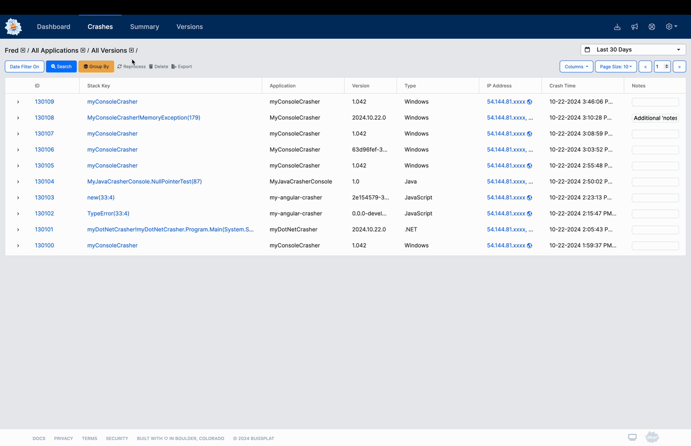

# Remove Crashes

When working with new tools, it can take a few rounds of trial and error before you get things exactly right. In BugSplat, sometimes this means posting a crash from a test application or otherwise creating clutter in your workspace. Never fear! BugSplat allows you to batch remove clutter from your database.


Removing crashes is a destructive action that can't be undone. Tread carefully!


### Steps 🥾

1. Navigate to the [Crashes](https://app.bugsplat.com/v2/crashes) page and select your BugSplat database
2. Filter and sort to a list of crashes that you would like to remove
3. Carefully review the list of crashes in your current view. All crashes in the current view will be removed from your database.
4. Click the **🗑️ Delete** button to load a confirmation modal
5. Click **Delete** in the confirmation modal to delete your crashes

**Note:** deleting crashes should be done sparingly in the case of mistakes. If you'd like to stop processing crashes for a specific version, consider using the retire crashes feature or create a new database instead.

<figure><figcaption>
Deleting Invalid Crash Reports
</figcaption></figure>

