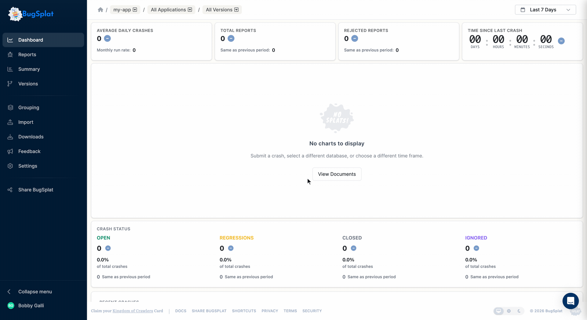

# Send Feedback

We value and encourage user feedback.  Hearing what could help make BugSplat better for you is one of the best tools we have for improving our product offering. 

Many of our best features over the years have come out of user feedback and participation.

If there's something you think we need to know - make sure to pass it along! 

### In-app

The first way to provide feedback is to click the **Feedback** button — the megaphone icon in the left navigation — which opens our product feedback tool.  

Our support team gets alerted as soon as any feature request or bug is submitted. 

Note: The feedback tool loads through our Intercom integration. If clicking **Feedback** doesn't open anything, it is likely getting blocked from loading by some tool in your browser.

### Email

Please also feel free to contact the support team with feedback via email by sending a note to [support@bugsplat.com](mailto:support@bugsplat.com)l

