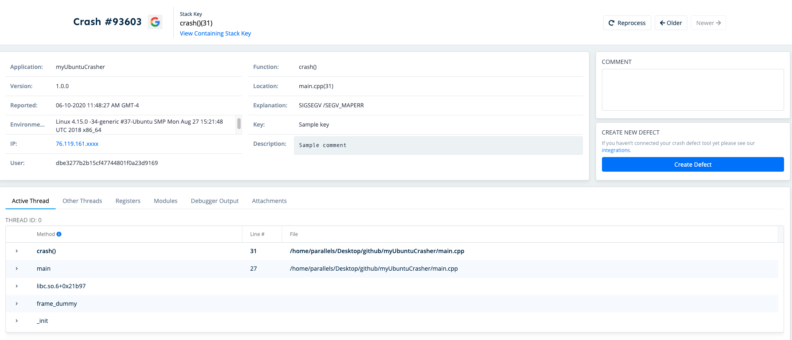

# Linux

## Introduction

Before integrating a new BugSplat SDK with your application, make sure to review the [Getting Started](https://www.bugsplat.com/resources/bugsplat-101/) resources and complete the simple startup tasks listed below.

* [Sign up](https://app.bugsplat.com/v2/sign-up) for a BugSplat account
* [Log in](https://app.bugsplat.com/auth0/login) using your email address
* Create a new [database](https://app.bugsplat.com/v2/company) for your application


**Need any further help?** Check out the full BugSplat documentation [here](https://www.bugsplat.com/docs), or email the team at [support@bugsplat.com](mailto:support@bugsplat.com).


## Overview

For Linux crash reporting, BugSplat recommends using [Crashpad](https://chromium.googlesource.com/crashpad/crashpad). Crashpad is the latest open source crash reporting tool built by Google and is the successor to the popular Breakpad crash reporter and allows you to submit minidumps to a configured URL after a crash occurs in your product.

Before continuing with the tutorial please review our [myUbuntuCrasher](https://github.com/BugSplat-Git/myUbuntuCrasher) sample application

## Tutorial

The first step in integrating with Crashpad is to ensure that your system has all the required dependencies. These dependenices include `git`, `python`, `llvm` and `clang++`. The following snippet will download and install all the dependencies on an Ubuntu system:

```text
sudo apt-get install git
sudo apt-get install python
sudo apt-get install llvm
sudo apt-get install clang
```

Next, you will need to build and integrate Crashpad with your application. For a step by step guide on how to build and integrate Crashpad please see this [doc](https://www.bugsplat.com/docs/sdk/crashpad/building).

Once you've built and integrated Crashpad you will need to ensure that your application is built with symbolic information and a build identifier. Symbolic information is required in order to map the stacktrace in the minidump to function names and line numbers in your application's source. A build identifier is required so that `minidump_stackwalk` can match modules loaded at runtime with the corresponding `.sym` file.


When specifying the Crashpad libraries `libbase.a` must be the last library argument specified otherwise your code will not compile.


If you are building with `clang++`, specify the `-g` flag to ensure the output executable contains symbolic information for debugging. Additionally when building with `clang++` you must pass the `-Wl,--build-id` argument in order to ensure the linker creates a build identifier in the output executable. The following [script](https://github.com/BugSplat-Git/myUbuntuCrasher/blob/master/scripts/compile.sh) from [myUbuntuCrasher](https://github.com/BugSplat-Git/myUbuntuCrasher) demonstrates how to link the Crashpad libraries and output an executable with symbolic information using `clang++`:

```text
#!/bin/bash
source exports.sh

clang++ -pthread $PROJECT_DIR/main.cpp \
  $CRASHPAD_DIR/lib/libclient.a \
  $CRASHPAD_DIR/lib/libutil.a \
  $CRASHPAD_DIR/lib/libbase.a \
  -I$CRASHPAD_DIR/include \
  -I$CRASHPAD_DIR/include/third_party/mini_chromium/mini_chromium \
  -o$OUT_DIR/$MODULE_NAME \
  -g \
  -Wl,--build-id
```

Finally, you will need to use the Breakpad tools `dump_syms` and `symupload` in order to generate and upload `.sym` files to BugSplat. Instructions on how to build these tools can be found [here](https://www.bugsplat.com/docs/sdk/crashpad/building/#generating-symbols).

Once you've built `dump_syms` and `symupload` the following [script](https://github.com/BugSplat-Git/myUbuntuCrasher/blob/master/scripts/symbols.sh) will generate symbols and upload them to BugSplat:

```text
#!/bin/bash
source exports.sh

export SYM_FILE=$OUT_DIR/$MODULE_NAME.sym

$CRASHPAD_DIR/tools/dump_syms $PROJECT_DIR/out/$MODULE_NAME > $SYM_FILE
$CRASHPAD_DIR/tools/symupload $SYM_FILE "https://$BUGSPLAT_DATABASE.bugsplat.com/post/bp/symbol/breakpadsymbols.php?appName=$BUGSPLAT_APP_NAME&appVer=$BUGSPLAT_APP_VERSION"
```

It's important that you re-upload symbols each time you build your application otherwise BugSplat will not be able to generate function names and line numbers for the crash report. Symbols should be uploaded using a new version for every build to ensure that your crashes are processed quickly.

If you've set everything up correctly, your crash report should look like this:



