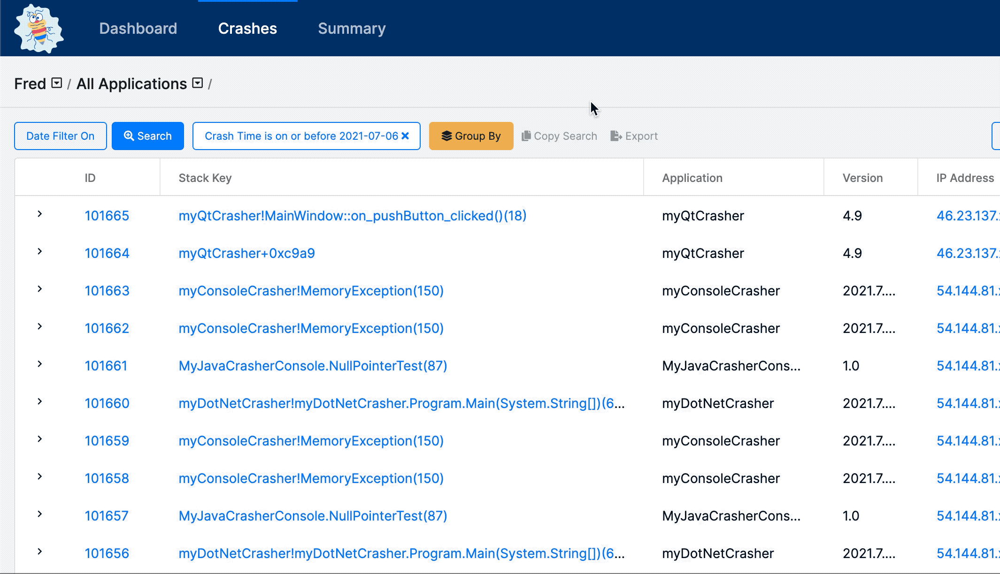

# Searching, Filtering, and Grouping Crash Data

## Overview

Searching to find information about a specific crash or [stack key](../../background/key-concepts.md#stack-key) is a critical part of the BugSplat workflow. BugSplat uses filtering to allow users to build customizable and powerful searches and crash groups.

Users can further filter their data using the Group By tools which allow for custom views of application data based on a host of different filter types.

## Search

To use the search tool first click on the button labeled Search which can be found on the Crash, Summary, and Key Crash pages.

Using the dropdown users can filter table results to search their dataset.  In BugSplat, users can filter their crash data based on almost any piece of data attributed to a crash or stack key.

Want to find a certain range of crash id's?  Need to isolate all crashes that happened before a certain date?  Crafting a filter set to isolate any data group you need is straightforward and intuitive.

### Attributes

There are four types of attributes. Each has different filters:

* **Text:** 'is equal to', ''is not equal to', 'contains', 'does not contain', 'is empty', 'is not empty', 'starts with', 'ends with'.
* **Numbers:** 'is equal to', ''is not equal to', 'contains', 'does not contain', 'is empty', 'is not empty', 'starts with', 'ends with'.
* **Mixed:** 'is equal to', 'is not equal to', 'contains', 'does not contain', 'is empty', 'is not empty,s tarts with', 'ends with', 'is less than', 'is greater than'.
* **Date:** ‘is on or before',  'is on or after'.

**Note on special filters**

### Basic use cases

Our search capability is built into many of the pages in BugSplat \(Crash, Summary, Key Crash, and more\).

To begin crafting a search, you must first click on the `+ Search` button found on the top right-hand corner of a dataset.

Next, select your first filter from the dropdown list. For example, if you want to choose all crashes with a Crash ID number larger than 9330, then you should filter for 'ID is greater than 9330' and hit **Submit**.

This will populate the below table with all results that fit your 'ID is greater than 9330' query.

If you are looking for a more specific subset of data, select `+ Search` again and add another filter. For example, you may want to find all crashes with an ID of more than 9330 that occurred after May 19th. To do that you should filter for 'Crash Time is greater than 05/19/2020' and hit **Submit.**

### Sharing and exporting searches

Once you have the correct set of data selected, you might want to click 'Copy,' to save the URL to your clipboard to share with a team member.

**Note:** You can also bookmark a search URL to return to soon. Soon we will be adding a feature that allows you to have a list of saved searches in the app.

You can also export the selected data to a JSON file using the Export button. Note that Excel can import JSON data directly. 

### 

## Group By

BugSplat's application data grouping and aggregation in search tool provides insight into your application's data and allows you to prioritize fixes based on a wide variety of criteria. The `Group By` tool is available on the [Crashes](https://app.bugsplat.com/v2/crashes) page.

### Basic use cases

Group By Email or IP address to determine which customers are crashing most often. Knowing which users are crashing the most allows your team to proactively fix issues instead of waiting for users to complain or give up on your software.

Group By Application and Version to see which versions of your application are crashing the most. Knowing which versions are most problematic allows your team to selectively roll out updates or messaging to get users to upgrade to a stable version of your software.

Group By Error Message or Error Code to see which types of errors are occurring most frequently. If specific errors are more likely to occur in your application, this knowledge can help developers search for potential problems when doing code reviews.

### Advanced use cases

BugSplat's Key field can be set to an arbitrary value at runtime. If your team chooses to set the Key value to the user's locale, you can Group By Key to see which geographic locations are crashing most frequently. The Key field can also be set to a value representing the user's video card or graphics driver. Users can use Group By to determine which video cards are most problematic.

Group By Stack Key and User to see how many unique customers see a specific crash. Knowing which crashes are occurring for the most unique users allows your team to fix the issues that will have the most significant impact. You can export the results as a CSV file and count the number of rows for each Stack Key to determine which crash has been seen by the most users.

### Digging deeper into data

If you want to dig deeper into a specific group of crashes, simply expand the row you're interested in. There you will find useful data on the group and several sample crashes. To load the full set of crashes that meet the criteria you're interested in exploring, just click the 'Load all results' link.

