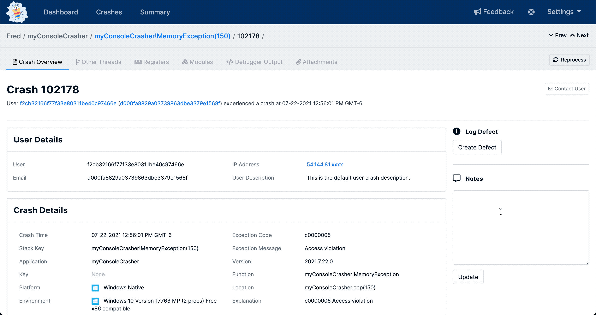

# Commenting

BugSplat allows for users to leave comments and have discussions about crashes and stack keys.  

### Leaving Comments

Using the Activity modal found at the bottom of the [Crashes](using-the-app.md#crashes) and [Stack Key](using-the-app.md#stack-key) pages allows users to comment and discuss issues pertaining to the defect.  

This can be a useful tool for making personal notes or for having a larger discussion with team members. 

Comments left in the Activity modal persist and are viewable by anyone with access to the Database where the crash or stack key lives.

### Adding a Note

Notes differ slightly from Comments as they are not designed to foster a conversation around a crash or stack key, but are used to manually add details important to understanding the crash. 

The Notes tools live in the right-hand action column of the [Crashes](using-the-app.md#crashes) and [Stack Key](using-the-app.md#stack-key) pages.  

When text is added to the Notes tool that text is Searchable and also appears in line with other crash and error data on the [Crashes](using-the-app.md#crashes) page. 

Team's use this tool to add custom, searchable data to crash reports and stack keys.

