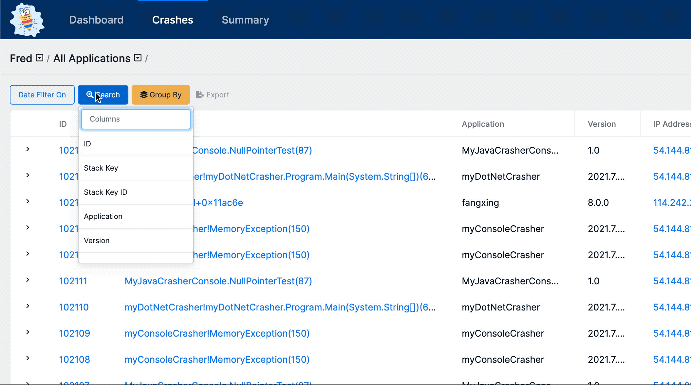
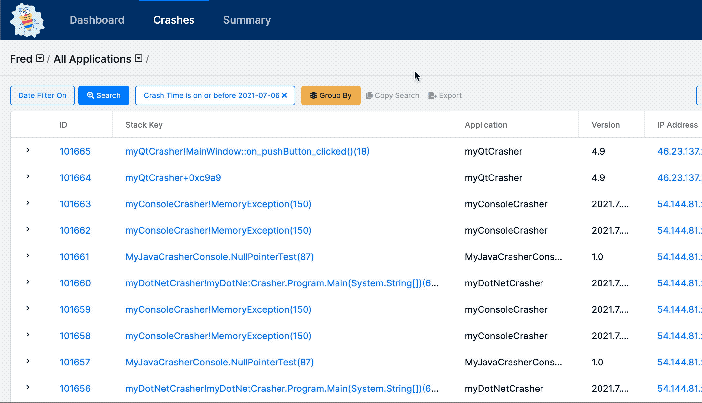

# Filtering

## Overview

Searching to find information about a specific crash or [stack key](../../education/bugsplat-dictionary.md#stack-key) is a critical part of the BugSplat workflow. BugSplat uses filtering to allow users to build customizable and powerful searches and crash groups.

Users can further filter their data using the Group By tools which allow for custom views of application data based on a host of different filter types.

## Search

To use the search tool first click on the button labeled Search which can be found on the Crash, Summary, and Key Crash pages.

Using the dropdown users can filter table results to search their dataset.  In BugSplat, users can filter their crash data based on almost any piece of data attributed to a crash or stack key.

Want to find a certain range of crash id's?  Need to isolate all crashes that happened before a certain date?  Crafting a filter set to isolate any data group you need is straightforward and intuitive.

### Attributes

There are four types of attributes. Each has different filters:

* **Text:** 'is equal to', ''is not equal to', 'contains', 'does not contain', 'is empty', 'is not empty', 'starts with', 'ends with'.
* **Numbers:** 'is equal to', ''is not equal to', 'contains', 'does not contain', 'is empty', 'is not empty', 'starts with', 'ends with'.
* **Mixed:** 'is equal to', 'is not equal to', 'contains', 'does not contain', 'is empty', 'is not empty,s tarts with', 'ends with', 'is less than', 'is greater than'.
* **Date:** ‘is on or before',  'is on or after'.

**Note on special filters**

### Basic use cases

Our search capability is built into many of the pages in BugSplat \(Crash, Summary, Key Crash, and more\).

To begin crafting a search, you must first click on the `+ Search` button found on the top right-hand corner of a dataset.

Next, select your first filter from the dropdown list. For example, if you want to choose all crashes with a Crash ID number larger than 9330, then you should filter for 'ID is greater than 9330' and hit **Submit**.

This will populate the below table with all results that fit your 'ID is greater than 9330' query.

If you are looking for a more specific subset of data, select `+ Search` again and add another filter. For example, you may want to find all crashes with an ID of more than 9330 that occurred after May 19th. To do that you should filter for 'Crash Time is greater than 05/19/2020' and hit **Submit.**

### Sharing and exporting searches

Once you have the correct set of data selected, you might want to click 'Copy,' to save the URL to your clipboard to share with a team member.

**Note:** You can also bookmark a search URL to return to soon. Soon we will be adding a feature that allows you to have a list of saved searches in the app.

You can also export the selected data to a JSON file using the Export button. Note that Excel can import JSON data directly. 

### 

