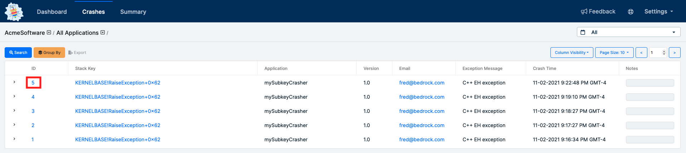
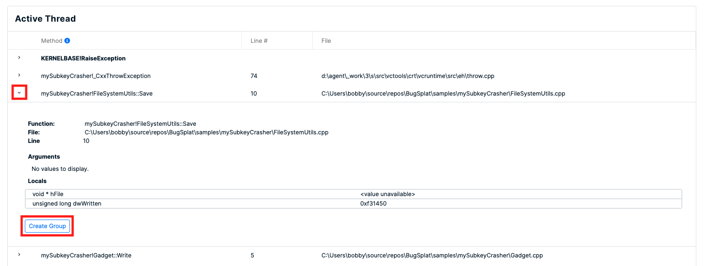
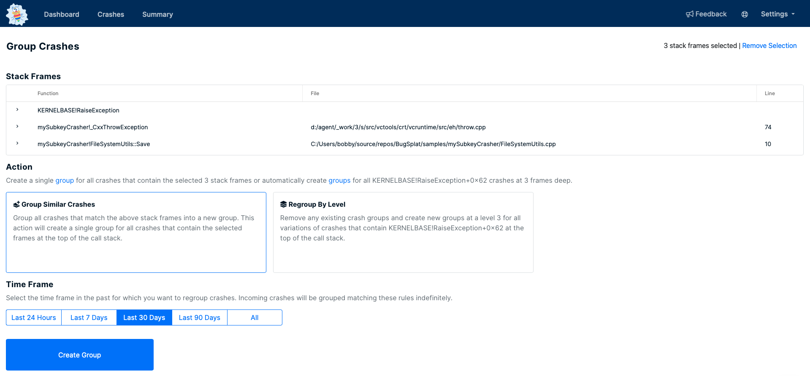
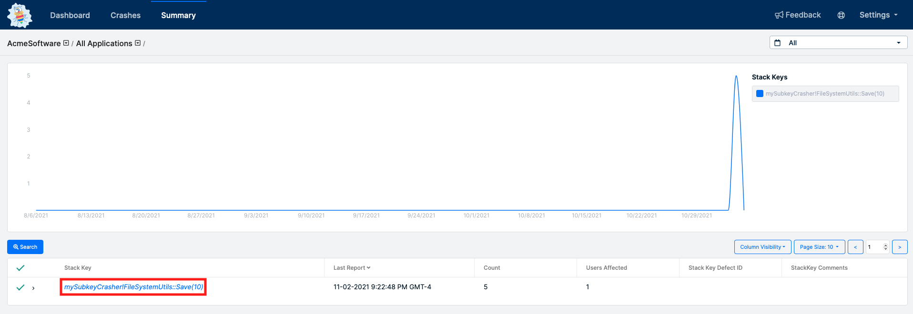
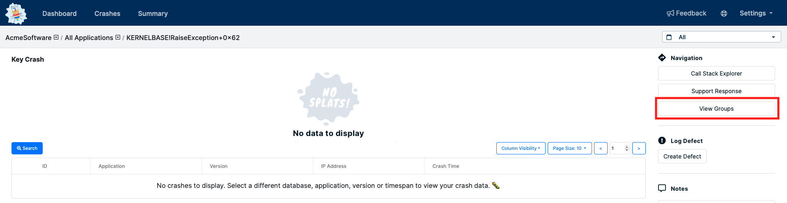
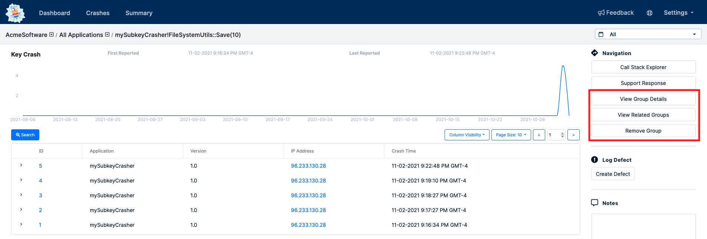

# Grouping Crashes

## Overview

It can be difficult to wrangle with large amounts of crash data. Deciding which crashes your team should focus on might seem daunting. For large applications, it's nearly impossible to investigate every crash that has been submitted to BugSplat. Fortunately, BugSplat allows teams to group similar crashes and fix the root cause of multiple crash reports in one fell swoop. Crash grouping also helps speed up the analysis of specific crashes by ignoring uninteresting frames at the top of the call stack.

## How-To

Groups of crashes can be viewed on BugSplat's [Summary](https://app.bugsplat.com/v2/summary) page. By default, all crashes are grouped by the frame that was at the top of the stack when an application crashed. Sometimes the top of a crash's stack may contain a single frame (or several frames) of common code that causes unrelated crashes to be grouped together. The simplest example of when crashes are grouped incorrectly is in C++ crashes from raised exceptions. Let's take a look at how we can separate crashes with **KernelBase!RaiseException** at the top of the stack into more descriptive crash groups.

### Crashes Page

On the crashes page, there's a list of crashes that all contain KernelBase!RaiseException at the top of their stack. We know that KernelBase!RaiseException is a common runtime stack frame that is added for all C++ crashes caused by thrown exceptions. In order to find the root cause of the issue, click the value in the ID column to navigate to the **Crash** page.

### Crash Page

On the Crash page, scroll down to the list of stack frames for the crashing thread. Expand any of the frames below KernelBase!RaiseException to reveal the **Create Group** button. Click the button to navigate to the **Group Crashes** page.

### Group Crashes Page

The Group Crashes page is used to create new crash groups and recategorize a set amount of existing crashes into newly created groups. There are two ways to create crash groups on the Group Crashes page.

#### Group Similar Crashes

The most fundamental action on the Group Crashes page is **Group Similar Crashes**. This action will group all crashes that match each of the displayed stack frames at the top of the stack. This means that crashes with RaiseException, \_CxxThrowException, and FileSystemUtils::Save at the top of the stack will be grouped by **FileSystemUtils::Save**. However, crashes with RaiseException, \_CxxThrowException, SomeOtherFunction at the top of the stack will still be grouped by **KernelBase!RaiseException**.

#### Regroup Crashes By Level

Regrouping by level is an automated way to create several crash groups at a specified call stack depth. This action can be thought of as a **Group Similar** action for all variations of crashes with KernelBase!RaiseException that share the topmost 3 stack frames. This means that crashes with RaiseException, \_CxxThrowException, and FileSystemUtils::Save at the top of the stack will be grouped by **FileSystemUtils::Save**. Additionally, crashes with RaiseException, \_CxxThrowException, SomeOtherFunction at the top of the stack will be grouped by **SomeOtherFunction**.

#### Time Frame

All incoming crashes will be grouped based on the specified rule. However, it might be desirable to apply the new grouping rule(s) to existing crashes in a database. Select a period of time in which you would like BugSplat to retroactively apply the new grouping preference. Please note that the longer the time frame you select the longer the action will take to complete.

#### Remove Group

When a group exists for a specified call stack and depth, the **Remove Group** button will show when **Group Similar** is selected. This action will allow you to stop crashes from being grouped by the specified rule. This action also allows you to specify a time frame in order to retroactively remove the group from BugSplat. You can group by level at a specified depth, and use Remove Group to remove a single rule from the set of rules that were automatically created at the specified level.

#### Remove Groups

When a specified call stack and depth has been grouped by level, the **Remove Groups** button will show when **Regroup By Level** is selected. This action will remove all groups for a crash and also allows you to specify a time frame in order to retroactively remove the groups from BugSplat.

#### Remove Selection

The **Remove Selection** link will discard the current selection and select only the top-most stack frame. Selecting the top-most frame allows you to regroup the call stack at level 1. Regrouping the stack at level 1 will remove all groups that have been created for crashes with KernelBase!RaiseException at the top of the stack and allows you to restart the grouping process if needed.

### Summary Page

Once new grouping rules have been applied, navigate to the [Summary](https://app.bugsplat.com/v2/summary) page to view an overview of the groups the selected database. The Summary page provides crash counts for all of the various groups. Targeting groups with the highest crash count will generally give teams the best return on their efforts. To get more information about the crashes that comprise a specific group, click the link in the **Stack Key** column to be brought to the **Crash Groups** page.

### Crash Group Page

The **Crash Group** page shows an overview of all the crashes in a specified group, as well as first seen and last reported metrics.

For default groups (aka the top of the stack) that have been split into sub-groups, such as KernelBase!RaiseException, a **View Groups** button will be displayed in the Navigation section on the right of the window. The View Groups button will navigate to the **Groups** page which will display a list of all groups that have been created from the parent group KernelBase!RaiseException. Note that since all crashes with KernelBase!RaiseException have been sub-grouped crashes will no longer appear in the default group, and can instead be found in the sub-groups.

For sub-groups, such as FileSystemUtils::Save, a **View Group Details** button will be displayed in the Navigation section on the right of the window. The View Group button will navigate to the **Groups** page filtered by the specified group. The Groups page will allow you to see the parent group as well as any sibling groups that might exist.

Sub-groups, such as FileSystemUtils::Save, will also display a **View Related Groups** button on the **Group Crash** Crash page. This button will navigate the user to a list of sibling groups that have been created for crashes with KernelBase!RaiseException at the top of the stack.

Finally, sub-groups will display a **Remove Group** button will be displayed in the Navigation section on the right of the window. This button will navigate the user to the **Group Crashes** page where a group or collection of groups can be removed.

