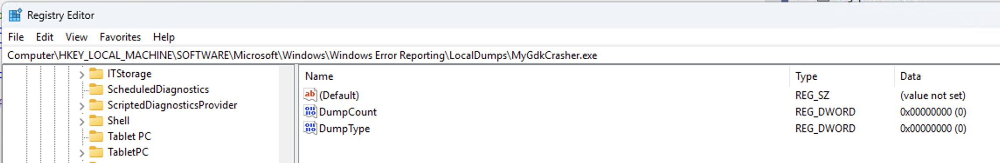

# Grouping Crashes

## Overview

Deciding which crashes your team should focus on can seem daunting. For many applications, it's impossible to investigate every crash. Fortunately, BugSplat automatically groups similar crashes, allowing you to concentrate your efforts on the bugs causing the most instability. &#x20;

BugSplat's [Summary](https://app.bugsplat.com/v2/summary) page is a table of crash groups. Usually, crash reports are grouped by the top stack frame when the application crashes. However, sometimes the top of a stack contains common code that causes unrelated crashes to be grouped together. When this happens, auto-group rules can automatically select a lower stack frame that more accurately groups related crashes.

### Auto-Group Rules

BugSplat has a set of customizable rules that skip over functions that are typically not interesting to application developers. Our default rules are designed to get you started quickly and can be modified as required for each crash report database.

The auto-group rules are pattern-based matching rules that skip irrelevant stack frames and create more meaningful crash groups. The three types of rules are **group by**, **group after,** and **ignore** frames. Rules are defined per platform and can be specified to match either the function or file portion of the call stack.&#x20;

You can view and change Auto-Group rules on the [Settings/Grouping](https://app.bugsplat.com/v2/settings/database/grouping) page.

Let's take a look at how BugSplat groups a report with the Windows OS function `KERNELBASE!RaiseException` at the top of the stack. Our default rule is shown below:

<figure><figcaption>
Default Ignore Rule
</figcaption></figure>

This rule, for Windows Native C++ crash types, **groups after** any stack frame where the function matches `KERNELBASE*`. When BugSplat processes reports containing `KERNELBASE!RaiseException`, the rule matches and crashes will automatically be grouped by the following frame of the call stack.  Group after rules are useful for excluding frames that are known to be common error conditions. \

Developers can also add rules that **group by** frames matching certain patterns. **Group by** rules are useful for including items that can be identified as belonging to your application. For example, you might choose **group by** to specify a file matching a path on your build machine, or a function matching your main application's module.

Auto-Group rules are matched via [glob patterns](https://en.wikipedia.org/wiki/Glob\_\(programming\)). The following table describes common glob patterns.&#x20;

| Pattern  | Description                                                                                      | Example       | Matches                                                  | Does not match                        |
| -------- | ------------------------------------------------------------------------------------------------ | ------------- | -------------------------------------------------------- | ------------------------------------- |
| `*`      | matches any number of any characters including none                                              | Law\*         | Law, Laws, or Lawyer                                     |                                       |
| `**`     | matches any number of path/directory segments. When used must be the only contents of a segment. | /\*\*/some.\* | /foo/bar/bah/some.txt, /some.txt, or /foo/some.txt       |                                       |
| `?`      | matches any single character                                                                     | ?at           | Cat, cat, Bat or bat                                     | at                                    |
| `[abc]`  | matches one character given in the bracket                                                       | \[CB]at       | Cat or Bat                                               | cat or bat                            |
| `[a-z]`  | matches one character from the range given in the bracket                                        | Letter\[0-9]  | Letter0, Letter1, Letter2 up to Letter9                  | Letters, Letter or Letter10           |
| `[!abc]` | matches one character that is not given in the bracket                                           | \[!C]at       | Bat, bat, or cat                                         | Cat                                   |
| `[!a-z]` | matches one character that is not from the range given in the bracket                            | Letter\[!3-5] | Letter1, Letter2, Letter6 up to Letter9 and Letterx etc. | Letter3, Letter4, Letter5 or Letterxx |

Auto-group rules are processed in a specific, consistent order that cannot be changed. The rules engine follows the logic below:

* If there are any **group by** stack frame matches, select the top-most matching frame as the candidate frame. Starting with this frame, skip over any frames that match the **ignore** rules until finding the first frame that isn't to be ignored. Use the resulting frame for grouping. Don't process any more rules.
* If there are any **group after** stack frame matches, select the lower-most matching frame as the candidate frame. Starting with this frame, skip over any frames that match the **ignore** rules until finding the first frame that isn't to be ignored. Use the resulting frame for grouping. Don't process any more rules.
* At this point neither **group by** nor **group after** rules matched any stack frames. The rules engine will apply the **ignore** rules starting with the top stack frame, skipping over any frames that match the **ignore** rules until it finds the first frame that isn't to be ignored. The resulting frame is used for grouping.


When you specify a new Auto-Group rule, it will be applied to newly processed and reprocessed crashes only. If you'd like to batch reprocess crashes to apply new rules, please reach out to [Support](mailto:support@bugsplat.com).


### Crashes Page

The [**Crashes**](https://app.bugsplat.com/v2/crashes) page displays a list of reports and their associated group under the **Stack Key** column. We've added a rule that effectively skips `KERNELBASE!RaiseException` and the reports are now grouped by the next frame in the stack `MyConsoleCrasher!_CxxThrowException(75)`. To see the report's stack trace, click the value in the **ID** column.

<figure><figcaption>
Crash Page
</figcaption></figure>

### Crash Page

On the **Crash** page, scroll down to the list of stack frames for the crashing thread. Notice that we didn't quite get our grouping rules correct. Our rules have caused the report to be grouped under the function in bold, `MyConsoleCrasher!_CxxThrowException`**.** The function we actually want to group on is `MyConsoleCrasher!ThrowByUser`. Expand the row containing `MyConsoleCrasher!ThrowByUser` to reveal the **Group Rules** button.

<figure><figcaption>
Crash Page with Stack Frame Expanded
</figcaption></figure>

We can click **Group Rules** and add another rule that **groups after** stack frames where the function matches the glob `*_CXXThrowException*`. After creating this rule and reprocessing the crash report, you will see the correct grouping.&#x20;

### Key Crash Page

The **Key Crash** page shows an overview of all the crashes in a specified group, as well as first-seen and last-reported metrics. For default groups (aka the top of the stack) that have been split into sub-groups, such as `KERNELBASE!RaiseException`, a **View Groups** button will be displayed in the **Navigation** section on the right of the window. The **View Groups** button will navigate to the **Groups** page which will display a list of all groups that have been created from the parent group `KERNELBASE!RaiseException`. Note that since all crashes with `KERNELBASE!RaiseException` have been grouped crashes will no longer appear in the default group, and can instead be found in the child groups.

<figure><figcaption>
Key Crash Page for Default Group
</figcaption></figure>

For child groups, such as `MyConsoleCrasher!ThrowByUser`, a **View Group Details** button will be displayed in the **Navigation** section on the right of the window. The **View Group** button will navigate to the **Groups** page filtered by the specified group. The **Groups** page will allow you to see the parent group as well as any sibling groups that might exist.

Child groups, such as `MyConsoleCrasher!ThrowByUser`, will also display a **View Related Groups** button on the **Group Crash** Crash page. This button will navigate the user to a list of sibling groups that have been created for crashes with `KERNELBASE!RaiseException` at the top of the stack.

### Summary Page

Once new grouping rules have been applied, navigate to the [**Summary**](https://app.bugsplat.com/v2/summary) page to view an overview of groups in the selected database. The **Summary** page provides report counts for all of the various groups. Targeting groups with the highest report **Count** will generally give teams the best return on their efforts. Another interesting metric to target is **Users Affected,** which represents the number of unique users that ran into a specific problem during the selected time frame.

<figure><figcaption>
Summary Page
</figcaption></figure>
