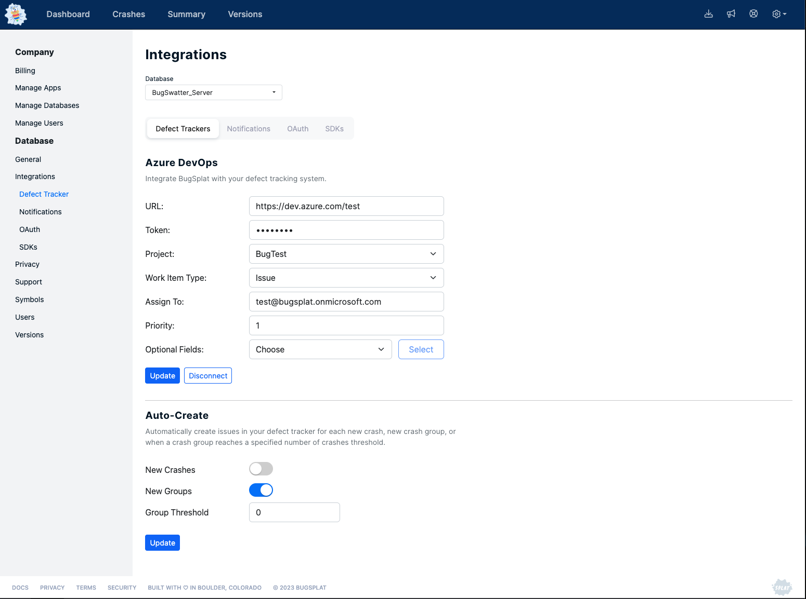

# Auto-Creating Defects from BugSplat Databases in Attached Third-Party Trackers

### Introduction

BugSplat provides the capability to auto-create issues in third-party trackers like [Jira](jira.md), [GitHub Issues](github-issues.md), [Azure DevOps](azure-devops.md), and [more](./) directly from BugSplat databases. The auto-created issues come bundled with comprehensive crash information, allowing for an easy understanding of the defects causing the crashes. This document details the process of setting up this feature.

### Setup Process

#### Location

The settings for this feature are located under the Integrations tab in the database settings. To access this, click on the following link: [Database Integrations Settings](https://app.bugsplat.com/v2/database/integrations).

<figure><figcaption></figcaption></figure>

#### Options

There are two primary options for auto-creating defects:

1. **Creating a new linked issue with every new crash**: This option will generate a new issue in your linked third-party tracker for each new crash recorded in BugSplat.
2.  **Creating a new linked issue with every new type of crash group**: This option will generate a new issue for each unique type of crash group that is recorded.

    For this option, you can also set a threshold for the number of crashes in a group that are needed before an automatic issue is created. By setting this to 0, an issue will be created for every new crash group.

#### Setting up the Feature

To set up the feature, follow these steps:

1. Navigate to the Integrations tab in the database settings via the link provided above.
2. Choose your preferred option. Remember to set your crash group threshold if you select the second option.
3. Save your settings.

Once these steps are completed, BugSplat will auto-create richly detailed issues in your selected third-party issue tracker each time the specified criteria are met.

### Future Features

We are constantly working on expanding our integrations and will be releasing additional features for third-party trackers in the near future.

### Feedback and Feature Requests

Your feedback helps us improve. Please send us your thoughts and suggestions at [support@bugsplat.com](mailto:support@bugsplat.com). We also welcome your requests for new features.

In doing so, you can help us shape the future of BugSplat's third-party tracker integrations to better meet your needs.
