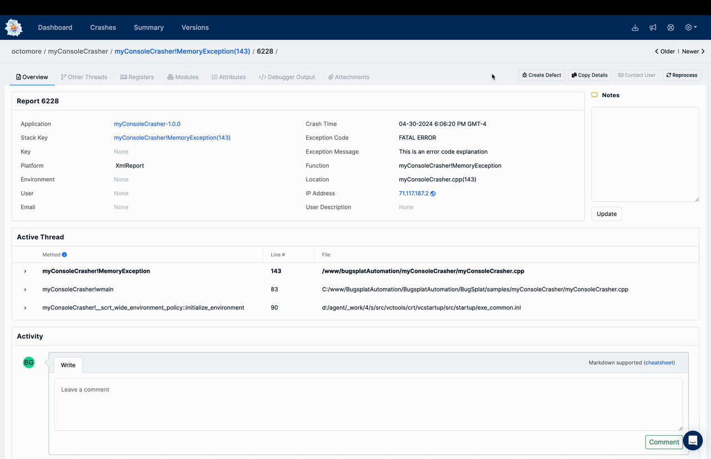

# GitLab


BugSplat's GitLab integration is in beta. Please message us if you want to request a feature or report a bug.


BugSplat allows your team to create issues in [GitLab](https://gitlab.com) with a few clicks. Our integration adds valuable crash data to your GitLab issues and links to the BugSplat dashboard so your team can quickly switch between looking at BugSplat and your GitLab repos.

#### Integrating GitLab and BugSplat

1. Login to your account.
2. Click the Gear icon (⚙️) at the top right of the page and navigate to the [Database Settings](https://app.bugsplat.com/v2/database/integrations) page, and under **Database > Integrations >** **Defect Tracker**, select **GitLab** from the options shown.
3. Enter your GitLab [personal API token](https://docs.gitlab.com/ee/user/profile/personal\_access\_tokens.html#create-a-personal-access-token) with the API scope into the field labeled **Token.**
4. Click **Update**.
5. Once you have connected to GitLab, you can select one of your projects from the **Projects** dropdown list.
6. After selecting your desired board, click **Update** again.

#### Push a New Item to GitLab

1. Use the **Create Defect** button to create a new item on the crashes page or a crash group page to push a new item to GitLab.
2. Enter relevant details and click the **Submit** button to create the defect.
3. Click the link to view the new GitLab issue created by BugSplat.
4. View the items' updates to see that stack trace and other valuable info from BugSplat.

<figure><figcaption>
Add BugSplat Item to GitLab
</figcaption></figure>

#### Automated Defect Creation 

Want to create issues in GitLab automatically for each new crash or crash group? Check out the document on auto-creating defects in your third-party defect tracker tool [here](https://docs.bugsplat.com/introduction/development/integrating-with-tools/issue-trackers/auto-creating-defects-from-bugsplat-databases-in-attached-third-party-trackers).
