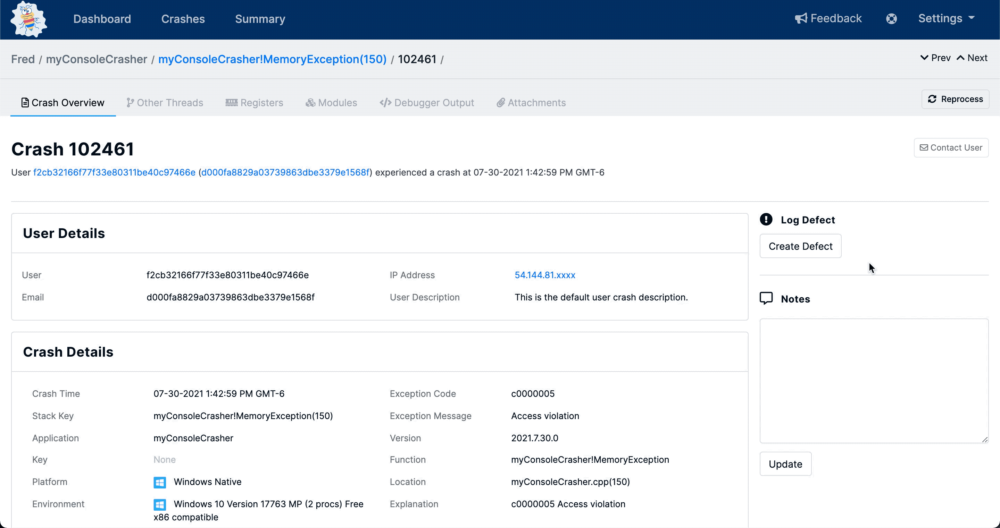

# Jira

Jira integration with BugSplat crash reports allows your team to create defects with a single-button click. Hyperlinks allow quick navigation from defects to crash reports and back. Defects created from BugSplat automatically include symbolic call stack information as well as other crash-specific data.

### Integrating Jira with BugSplat

1. Login to your account.
2. Go to the ‘[Options](https://app.bugsplat.com/v2/options)’ page and under ‘Defect Tracking System Setup’ select Jira from the drop-down menu.
3. Enter your Username, Password, URL, and IssueType into the appropriate boxes on the BugSplat ‘[Options](https://app.bugsplat.com/v2/options)’ page.
4. Click ‘Apply’.
5. Once a successful connection to Jira has been established, you will be able to select one of your projects from the project dropdown list.
6. After selecting your desired project, click ‘Apply’ again.

### Creating an issue in Jira from a BugSplat crash report

1. Create a new defect from an individual crash report page or a [stack key](../../../../education/bugsplat-terminology.md#stack-key) page by using the ‘Create a new defect’ link.

2. Selecting the ‘Create defect’ link brings you to this page.

3. Selecting the Submit button will create the defect.

4. Go to Jira to view your new issue based on your BugSplat crash report.

