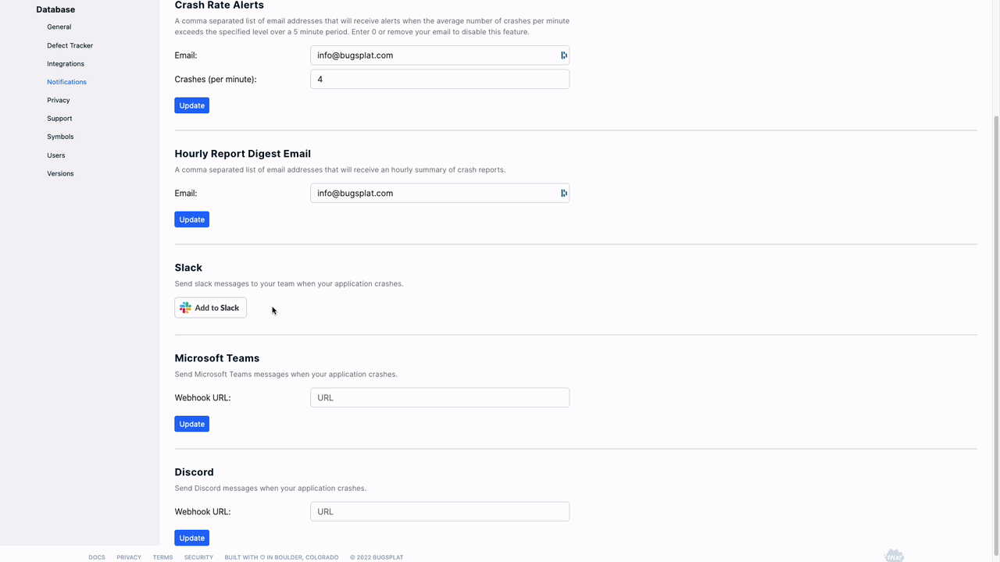

# Slack

BugSplat’s Slack integration allows your team to receive alerts for new crashes and errors or new groups of crashes or errors. Receiving BugSplat alerts through Slack lets you stay on top of your application's stability and can serve as an early warning that something might be wrong.

#### Integrating Slack with BugSplat 

1. Login to [BugSplat](https://app.bugsplat.com/cognito/login) and navigate to the [Notifications](https://app.bugsplat.com/v2/settings/database/integrations#notifications)page.
2. Select the Database for which you'd like to configure alerts
3. Under the **Slack** section, click the **Add to Slack** button.
4. You’ll be prompted to confirm your identity and choose which channel you would like the notifications posted to.
5. Select **Authorize**.
6. Use the toggle buttons to set your notification preferences. You can choose to be notified for each new report or each new unique report group.
7. Use the **Fields** dropdown to select the fields you'd like to include in your notifications.

<figure><figcaption>
Configuring BugSplat's Slack Integration
</figcaption></figure>
