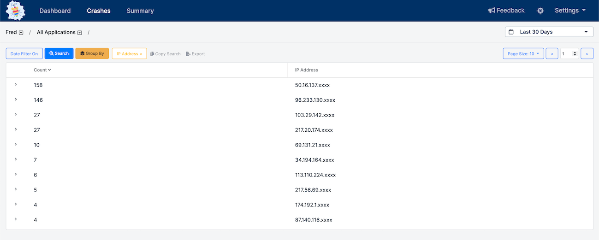

# Grouping

BugSplat's application data grouping and aggregation in search tool provides insight into your application's data and allows you to prioritize fixes based on a wide variety of criteria. The `Group By` tool is available on the [Crashes](https://app.bugsplat.com/v2/crashes) page.

## Basic Use Cases

Group By Email or IP address to determine which customers are crashing most often. Knowing which users are crashing the most allows your team to proactively fix issues instead of waiting for users to complain or give up on your software.

Group By Application and Version to see which versions of your application are crashing the most. Knowing which versions are most problematic allows your team to selectively roll out updates or messaging to get users to upgrade to a stable version of your software.

Group By Error Message or Error Code to see which types of errors are occurring most frequently. If specific errors are more likely to occur in your application, this knowledge can help developers search for potential problems when doing code reviews.

## Advanced Use Cases

BugSplat's Key field can be set to an arbitrary value at runtime. If your team chooses to set the Key value to the user's locale, you can Group By Key to see which geographic locations are crashing most frequently. The Key field can also be set to a value representing the user's video card or graphics driver. Users can use Group By to determine which video cards are most problematic.

Group By Stack Key and User to see how many unique customers see a specific crash. Knowing which crashes are occurring for the most unique users allows your team to fix the issues that will have the most significant impact. You can export the results as a CSV file and count the number of rows for each Stack Key to determine which crash has been seen by the most users.

## Digging Deeper into Data

If you want to dig deeper into a specific group of crashes, simply expand the row you're interested in. There you will find useful data on the group and several sample crashes. To load the full set of crashes that meet the criteria you're interested in exploring, just click the 'Load all results' link.

