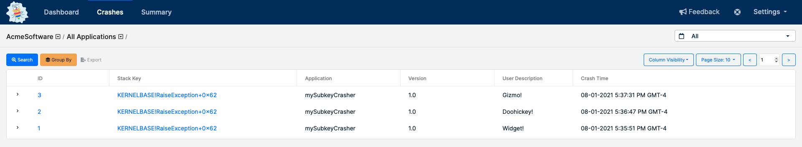

# Subkeying

Subkeying is a way to group a set of crashes at some level other than the top level of the call stack. At BugSplat, crashes are grouped by a [stack key](../../education/bugsplat-terminology.md#stack-key) and groups of crashes can be found on the Summary page.

By Default, BugSplat groups crashes using the topmost level of a call stack. A **subkey** is created when crashes are grouped at a level other than the top level of a call stack. Subkeying is useful when the default grouping contains a large number of crash reports with multiple code paths leading to a common crashing function.

This tool may help reduce or eliminate the need to debug a crash report on your local development machine.

When a crash happens in common code, such as a 3rd party library or system function, it is often the case that stack frames in application code are more useful in determining where the crash originated. Subkeying allows developers to group program crashes at a lower level in the stack trace so that they more accurately target their fixes in order to maximize product stability.

## Why is Subkeying Important?

Sorting program crashes brings visibility to problems customers are running into most often and allows developers to prioritize their fixes accordingly. For applications that generate large crash volumes, it may not be feasible to look at each crash individually. BugSplat’s [Summary](https://app.bugsplat.com/v2/summary) page provides an overview of the crashes. Subkeying allows teams to more accurately group crashes on the [Summary](https://app.bugsplat.com/v2/summary) page.

## Example

In our example application mySubkeyCrasher, Widget, Gizmo and Doohickey are all editable objects and the edits to each of these objects can be saved to the file system. These objects are loaded by an Editor which provides the Widget, Gizmo and Doohickey objects with a file path where they should be saved when the user has completed their edits.

In this example Widget, Gizmo and Doohickey inherit from an abstract class \(we’ll call this class “Thingy”\) that requires them to provide overrides for the **`void Save(LPCWSTR fileName)`** function. They each do things slightly differently before saving their edits but ultimately end up calling a common function **`void FileSystemUtils::Save(LPCWSTR fileName, char buffer[])`**. The common function ultimately throws an exception triggering a program crash.

When crashes from **mySubkeyCrasher** are processed by BugSplat, the top of the call stack, or the primary [stack key](../../education/bugsplat-terminology.md#stack-key), shows up as **`KernelBase!RaiseException+0x69`**. In this case the primary stack key is not useful as it doesn’t tell us much about why the crash actually occurred.

## Next Steps

BugSplat’s [Crashes](https://app.bugsplat.com/v2/crashes) page shows a list of all the crashes for our **mySubkeyCrasher** sample application. Notice that we have 3 sample crashes all with the stack key KernelBase!RaiseException+0x62 which isn’t particularly helpful.

Since these 3 crashes share the same stack key they are grouped together on the [Summary](https://app.bugsplat.com/v2/summary) page.

Since these crashes all share the same stack key, they are also grouped together on the [Key Crash](https://app.bugsplat.com/v2/keycrash?database=AcmeSoftware&stackKeyId=5) page.

Clicking the Call Stack Explorer link provides an in-depth look at each of the code paths that caused a program crash. The number next to each node represents how many crashes executed that line of code.

The call stack explorer helps you prioritize code paths, so that you can address the most important crashes first. In this example the **`Save function`** in the Doohickey, Gizmo and Widget classes are each responsible for 1 of the 3 crashes.

If, for instance, 1000 crashes had passed through the **`Save function`** in the Widget class, it would make more sense to look at crashes coming from the Widget class first as they would be far more prevalent than the crashes that included calls to the **`Save function`** in either the Doohickey or Gizmo classes.

To group crashes, click the link at any level of the call stack. For this example we’re going to pretend that significantly more crashes passed through the Widget class and click the link containing **`Widget::Save`** to navigate to the **Group Stacks** page.

In this case, clicking the **Group Reports** button creates new subkeys for crashes that match the 4th frame in the call stack as opposed to the 1st frame in the call stack. All crashes that match these 4 frames will be put in the same subkey, crashes that match the top 3 frames, but have a different value 4 frames deep will be put into a different subkey. This means that BugSplat will create new subkeys for crashes that pass through **`Doohickey::Save`**, **`Gizmo::Save`** and **`Widget::Save`**. Navigate to the [Summary](https://app.bugsplat.com/v2/summary) page to see the newly created subkeys.

The Summary view makes it much easier to see which subkeys are causing most of the crashes. We’ve decided to pretend that the **`Widget::Save`**function appeared in 1000 crashes, so we’ll go investigate that crash first. To do this, we’ll click the link under the stack key column containing the **`Widget::Save`**subkey, then click any of the crash ID links on the [Key Crash](https://app.bugsplat.com/v2/keycrash?database=AcmeSoftware&stackKeyId=5) page. Clicking on a crash ID will load the [Crashes](https://app.bugsplat.com/v2/crashes) page.

The **mySubkeyCrasher** sample uses the BugSplat Windows Native C++ SDK which means BugSplat will display function arguments and local variables for each function in the call stack. This allows us to see that the crash didn’t originate in Widget::Save. Notice the argument filePath is equal to the value /does/not/exist. The crash we’re chasing was actually a result of the Editor passing a bad path to Widget::Save! This means that we actually want to create subkeys at 5 frames into the call stack to isolate the actual problem.

Expand the **`Editor::Save`**row and click the Create Subkey to create a **subkey** at a depth of 5 frames. Once you’ve subkeyed at 5 frames deep, navigate to the [Summary](https://app.bugsplat.com/v2/summary) page. On the [Summary](https://app.bugsplat.com/v2/summary) page you’ll notice that if you fix the bug that originated in the **`Editor::Save`**function you’ll fix all of the crashes in that group!

Finally, if you’ve hooked BugSplat up to your [defect tracker](integrating-with-tools/#issue-trackers) you can create a defect for the group instead of for an individual crash. Navigate to the [Key Crash](https://app.bugsplat.com/v2/keycrash?database=AcmeSoftware&stackKeyId=5) page and click the Create Defect button. This will link every subkeyed defect to the issue you create in your defect tracker.

We hope you found this tutorial helpful. If you have any questions please reach out to us using the in-app chat feature, or via our support [email](mailto:support@bugsplat.com).

