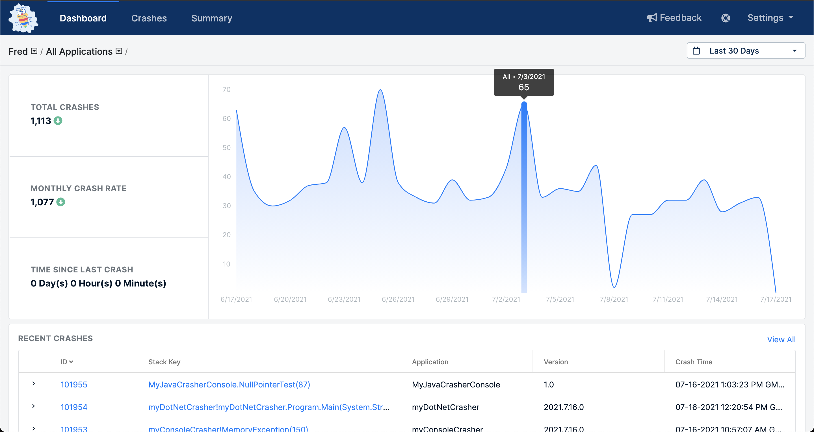
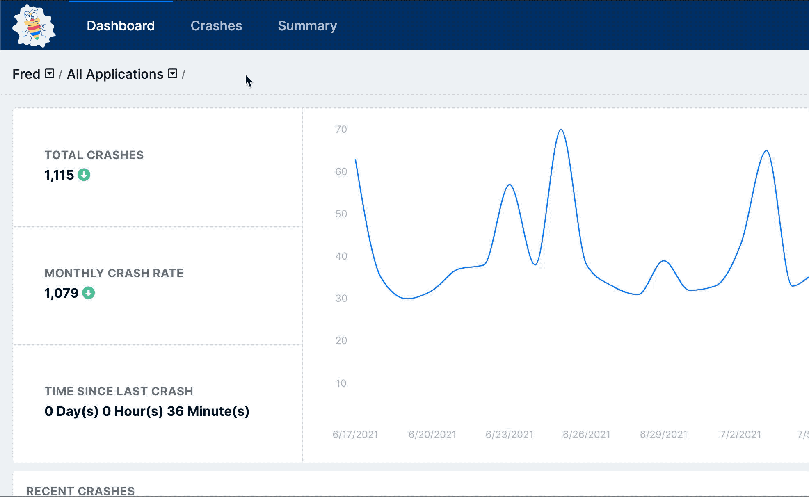
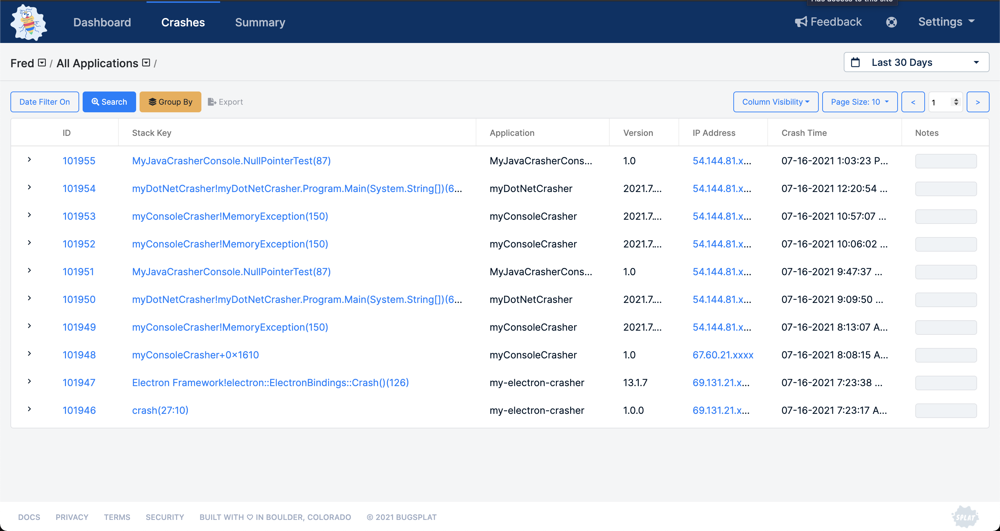
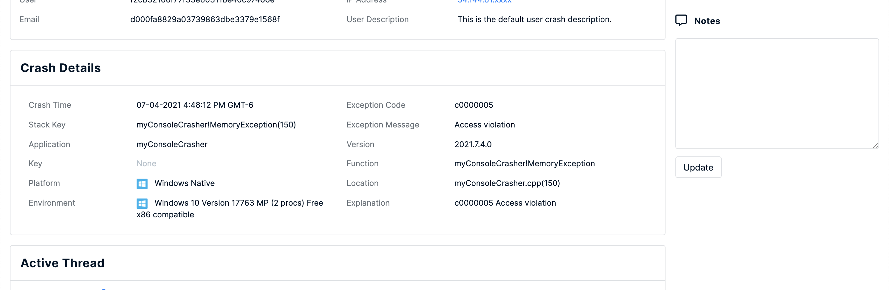
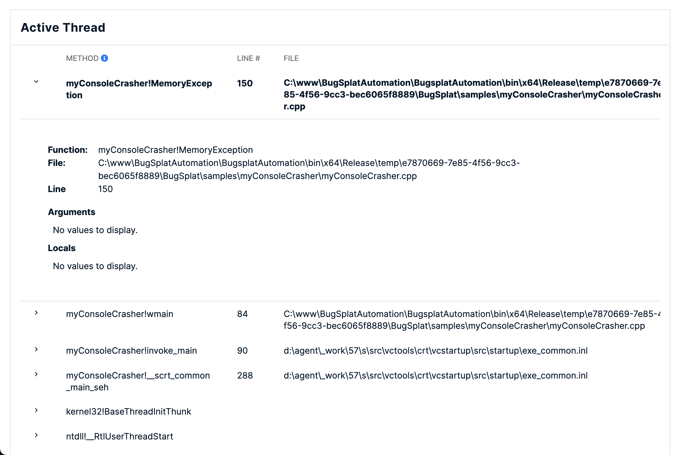
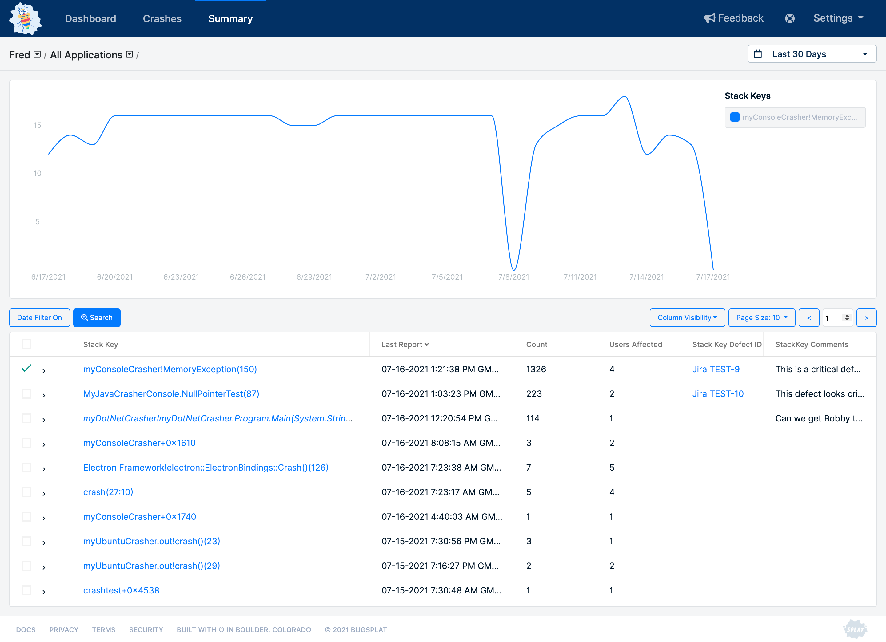

# Using the App

The BugSplat web application consists of three main pages: [Dashboard](https://app.bugsplat.com/v2/dashboard), [Crashes](https://app.bugsplat.com/v2/crashes), and [Summary](https://app.bugsplat.com/v2/summary). These pages sort and organize an application's crash data, helping users quickly and simply navigate to the information they need.

Each of the main pages has subpages that provide more detail on individual [crashes](../../education/bugsplat-terminology.md#crash-report), errors, [stack keys](../../education/bugsplat-terminology.md#stack-key), and other important data.

## Dashboard&#x20;

The [Dashboard](https://app.bugsplat.com/v2/dashboard) page is the application’s home and the place users land first inside the application. It provides users with an overview of how their application is performing and shows a list of the most recently submitted crashes.

## Navigating with breadcrumbs

BugSplat provides a breadcrumb navigation control so that users always know where they are in their data, what they're looking, and how to get back to where they were.

The breadcrumb control is laid out as follows `Database / Applications / Versions / ID`

The databases, applications, and versions controls contain searchable dropdowns that allow users to quickly find what they're looking for. Select a database to enable the applications dropdown. Next, select an application or multiple applications to reveal the versions dropdown. Select a version or multiple versions to filter the data further. Click the ID of a crash to see its details or click a crash's Stack Key to see information about the crash's group.

## Crashes

The [Crashes](https://app.bugsplat.com/v2/crashes) page contains all an application's crashes organized with the most recent crashes at the top of the table by default.

From here, users can manipulate the table in multiple ways to view specific sets of data.

First, users can filter the crashes using the [Searching](search.md) and [Grouping](grouping.md) tools to find specific crashes. The **Timeframe** filter on the top right can also choose a specific time period.

Second, users can select different data types using the **Column Visibility** dropdown to change what data is visible.

Third, users can sort by ascending or descending order in a column by clicking on the header text of that column.

Fourth, users can click the **>** on each individual row to expand that row and view more details about a specific crash. These details include crash metadata, call stack of the crashing thread, and a list of files that were attached to the crash report.

Finally, if a specific crash seems important and worthy of further investigation, click on the numbered link in the ID column to navigate to the corresponding report.

## Crash

The **Crash** page allows for users to get information critical for understanding and fixing the defect which originally caused the issue.

### User Details

The **User Details** component contains information about the user who experienced a crash. The User Details table will display who crashed, where they crashed (IP address), and the description provided by the user in the crash dialog. This information is sometimes [obfuscated to protect users](../production/security-privacy-and-compliance/gdpr.md) — like it is in the image below.

.png>)

### Crash Details

The **Crash Details** component summarizes the details of a specific crash. The Crash Details component contains information such as the crashing function, line number where the crash occurred, information regarding what type of crash took place, when the crash happened, what OS and SDK the crashing application was running on, and more.

### Active Thread

The **Method** column contains a list of functions in the stack trace of the thread that caused the program to crash. Depending on the [platform](../getting-started/integrations/) you may see methods that don't match your source code. This is because platforms such as [Windows Native](../getting-started/integrations/desktop/cplusplus/), [.NET Framework](../getting-started/integrations/desktop/windows-dot-net-framework.md), [Crashpad](../getting-started/integrations/cross-platform/crashpad/), [Breakpad](../getting-started/integrations/cross-platform/breakpad.md), [macOS](../getting-started/integrations/desktop/macos.md), [Unity Native](../getting-started/integrations/game-development/unity.md), and [Unreal](../getting-started/integrations/game-development/unreal-engine.md) require you to upload [symbols](working-with-symbol-files/) for each version you release in order to calculate the correct method names. For more information on how to upload symbols please see the documentation for your [platform](../getting-started/integrations/).

Clicking the **>** (greater than symbol) in the left-most column will expand the **Row Details** view.

The **Row Details** view will display the **Group Stacks** button that will allow you to create a [subkey](../../education/how-tos/using-subkeying-to-find-difficult-crashes.md). Grouping at a different level of the call stack is called [subkeying](../../education/how-tos/using-subkeying-to-find-difficult-crashes.md) and is useful in cases such as a crash that occurs in a 3rd party library, or when additional stack frames are added by a crash reporter.

Additionally, for [Windows Native](../getting-started/integrations/desktop/cplusplus/) crashes the **Row Details** view will show a table of [Local Variables and Function Arguments.](https://www.bugsplat.com/blog/development/local-variables-function-arguments/)

The Crash page includes valuable information like crash time, environment, corresponding function name and line number, containing [stack key](../../education/bugsplat-terminology.md#stack-key), and much more.

### Additional Information

All data covered to this point on the Crash page are found under the **Crash Overview** tab. To access additional information about crashes like **Other Threads**, **Registers**, **Modules**, **Debugger Output**, and **Attachments** — use the tabs found above the **User Details** module.

 (2) (2) (2) (2) (2) (2) (2) (2) (2) (2) (2) (2) (2) (2) (2) (2) (2) (2) (1).gif>)

## Summary

The [Summary](https://app.bugsplat.com/v2/summary) page shows a view of an application's crash data which automatically groups crashes by the top line of the call stack, allowing users to see which defects are occurring most frequently.

You can group by other levels of the call stack as well to differentiate defects using [Crash Grouping](grouping-crashes.md).

The **Summary** page allows for similar table navigation as the [Crashes](using-the-app.md#crashes) page. Users can search, manipulate column size, alter column visibility, and expand rows.

The Summary page has a line chart at the top of the page which shows the top stack key by default, although you can select multiple stack keys to display on the chart.

 (3) (3) (3) (3) (3) (3) (4).gif>)

## Key Crash

The **Key Crash** page shows a more in-depth view of all crashes found in a [stack key](../../education/bugsplat-terminology.md#stack-key).

The Key Crash page allows users to explore individual crashes, leave comments for team members, create defects based on the crash group, and more.

Companies that are using BugSplat's [Windows C++ SDK](../getting-started/integrations/desktop/cplusplus/) can create [Custom Support Responses](../production/setting-up-custom-support-responses.md) to alert their end-users to known issues identified with BugSplat. Support responses are a valuable tool for communicating with end-users about known fixes or to point them toward specific helpful docs.
