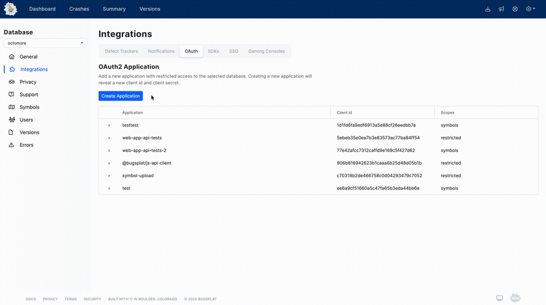

# OAuth2

BugSplat supports authenticating via OAuth 2.0 in addition to the username/password authentication described in our API documentation. Currently, only the OAuth2 client credentials flow is supported. If you are interested in exploring other OAuth 2.0 authentication methods, please contact [support@bugsplat.com](mailto:support@bugsplat.com).

A reference client implementation can be found in our [@bugsplat/js-api-client](https://github.com/BugSplat-Git/bugsplat-js-api-client/blob/1ebf36453d275ed62d6e5a4bb4249ef17efbc929/src/common/client/oauth-client-credentials-api-client/oauth-client-credentials-api-client.ts) repo.

### Client Credentials

To authenticate via OAuth2 client credentials, you will need to create a Client ID and Client Secret pair on the OAuth Integrations page. When prompted, enter an application name and choose a desired scope.

BugSplat scopes are hierarchical (not composable), and the available choices are either **symbols** or **restricted**. The only operation allowed by the **symbols** scope is [symbol upload](../../../education/faq/how-to-upload-symbol-files-with-symbol-upload.md). The **restricted** scope provides read-only access to the [Charting](api/charting.md), [Crash](api/crash.md), [Crashes](api/crashes.md), [Summary](api/crash-groups.md#summary), [Versions](api/versions.md), and [Key Crash](api/crash-groups.md#key-crash) APIs

<figure><figcaption><p>Adding a New Application</p></figcaption></figure>

Copy the Client ID and Client Secret to a secure location. Once you've dismissed the dialog, the Client Secret will not be displayed again.

#### Authorize

The Client ID and Client Secret are used in a POST to the server and will return `access_token` and a `token_type`. The [Authorize](oauth2.md#authorize-1) endpoint is described below.

#### Headers

Once an `access_token` and `token_type` have been acquired, they can be used in any of the API requests outlined in our [API docs](api/). To make an authenticated request to one of BugSplat's API endpoints, add a header with a key of `Authorization` and a value of `${token_type} ${access_token}`.

## Authorize

<mark style="color:green;">`POST`</mark> `https://app.bugsplat.com/oauth2/authorize`

Exchange a Client Id and Client Secret for a bearer token.

#### Request Body

| Name           | Type   | Description                                                                       |
| -------------- | ------ | --------------------------------------------------------------------------------- |
| scope          | string | OAuth2 scope, supported options include **symbols**, and **restricted**.          |
| client\_secret | string | The Client Secret created above                                                   |
| client\_id     | string | The Client Id created above                                                       |
| grant\_type    | string | <p>OAuth2 grant type, in this case,</p><p><strong>client_credentials</strong></p> |



```
{
  "token_type": "Bearer",
  "expires_in": 3600,
  "access_token": "eyJ0eXAiOiJKV1QiLCJhbGciOiJSUzI1NiJ9[...]"
}
```


